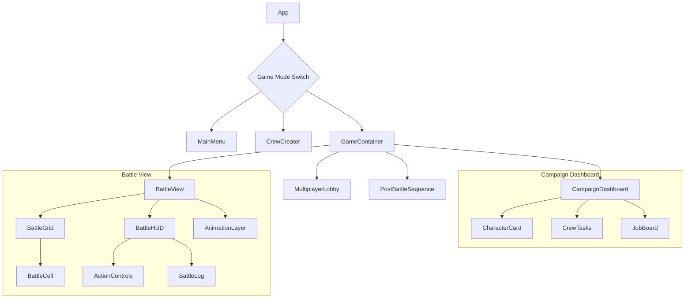
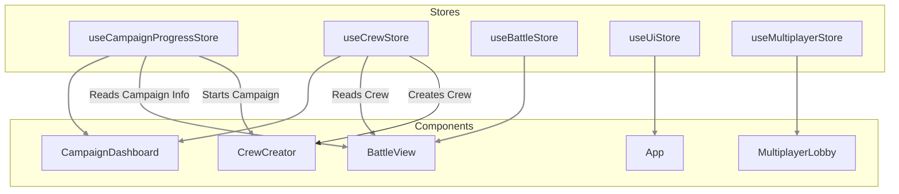

# Five Parsecs - Campaign Manager

This is a browser-based campaign manager for the solo sci-fi adventure wargame 'Five Parsecs From Home'. Create your crew, manage their progression, and use AI to enrich your story.

## ✨ Main Features

- **Crew Creation:** Procedurally generate unique characters with distinct backgrounds, motivations, and skills.
- **Campaign Management:** Track your crew's progress, manage resources, undertake jobs, and handle random events between battles.
- **Turn-based Tactical Combat:** A detailed grid-based combat system that handles movement, line of sight, cover, and various combat actions.
- **Multiplayer:** Battle against a friend in tactical PvP combat.
- **AI Story Enrichment:** Utilizes AI to generate rich backstories and narrative elements for your characters.

## 🛠️ Tech Stack

- **Framework:** [React](https://react.dev/)
- **Language:** [TypeScript](https://www.typescriptlang.org/)
- **State Management:** [Zustand](https://zustand-demo.pmnd.rs/)
- **Styling:** [Tailwind CSS](https://tailwindcss.com/)
- **Real-time Communication:** [PeerJS](https://peerjs.com/) for WebRTC
- **Build Tool:** [Vite](https://vitejs.dev/)

---

# Run and deploy your AI Studio app

This contains everything you need to run your app locally.

## 🚀 Run Locally

**Prerequisites:** Node.js

1.  Install dependencies:
   `npm install`
2.  Run the app:
   `npm run dev`

---

## 🏛️ Architecture Overview

### Component Hierarchy

This diagram shows the relationship between the main high-level components of the application.



### State Management (Zustand)

The application uses Zustand for global state management, dividing concerns into logical stores. Components subscribe to these stores to react to state changes.



## 📁 Project Structure

The project follows a feature-based structure, grouping related files by their domain.

```
/
├── components/       # Reusable UI components (both dumb and smart)
│   ├── battle/       # Components specific to the battle view
│   ├── campaign/     # Components for the campaign dashboard
│   └── ui/           # Generic, reusable UI elements (Button, Card, etc.)
├── constants/        # Static data, tables, and configurations (e.g., items, character creation tables)
├── context/          # React Context providers (Theme, Toast)
├── hooks/            # Custom React hooks for shared logic
├── i18n/             # Internationalization files and setup
├── services/         # Core application logic, separated from the UI
│   ├── application/  # Use cases that orchestrate domain logic
│   ├── domain/       # Pure business logic and rules
│   └── api/          # Services for external APIs (e.g., Gemini)
├── stores/           # Zustand state management stores
├── types/            # TypeScript type definitions
├── App.tsx           # Main application component
└── index.tsx         # Application entry point
```