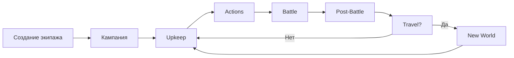

# 00. Общее описание

[← Назад к оглавлению](./README.md)

---

## Концепция

**Five Parsecs Campaign Manager** — браузерный менеджер кампании для настольной соло-игры *Five Parsecs From Home*. 

| Параметр | Значение |
|----------|----------|
| **Платформа** | Web (браузер) |
| **Жанр** | Solo/PvP тактическая варгейм-стратегия |
| **Технологии** | React, TypeScript, Zustand, Vite |

## Целевая аудитория

- Фанаты *Five Parsecs From Home*
- Любители соло-варгеймов
- Игроки, ценящие процедурную генерацию

## Ключевые фичи

| Фича | Описание |
|------|----------|
| **Создание экипажа** | Процедурная генерация персонажей |
| **Управление кампанией** | Ресурсы, задачи, патроны |
| **Тактический бой** | Grid-based с LoS и укрытиями |
| **Мультиплеер** | PvP через WebRTC |
| **AI-нарратив** | Бэкстори через Gemini AI |

## Игровой цикл

---

[Далее: Персонажи →](./01_Characters.md)
