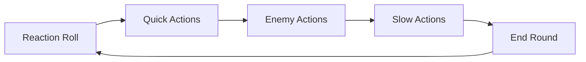

# 02. Боевая система

[← Назад к оглавлению](./README.md)

---

## Фазы боя



| Фаза | Описание |
|------|----------|
| **Reaction Roll** | 1d6 + Reactions ≥ 5 = Quick |
| **Quick Actions** | Персонажи с успехом |
| **Enemy Actions** | AI управляет врагами |
| **Slow Actions** | Персонажи с провалом |
| **End Round** | Проверка победы |

---

## Формулы

### Стрельба
```
Попадание: 1d6 + Combat + модификаторы ≥ 5
```

| Модификатор | Бонус |
|-------------|-------|
| Aimed Shot | +1 |
| В укрытии | -1 |
| Heavy после движения | -1 |
| Snap Shot | отменяет штраф |

### Урон
```
1d6 + Weapon Damage ≥ Toughness → CASUALTY
Натуральная 6 → всегда CASUALTY
Меньше → STUNNED + Pushback
```

### Спасброски
```
Luck: 1d6 ≥ 4 (тратит 1 Luck)
Armor: 1d6 ≥ значение брони (5+ или 6+)
Stim-Pack: автоспас от первого летального
```

### Brawl
```
Оба бросают: 1d6 + Combat + модификаторы
Победитель = кто выше
Ничья: атакующий (с Elegant) / защитник (с Clumsy)
```

---

## Действия

| Действие | Описание |
|----------|----------|
| **Move** | Перемещение на Speed клеток |
| **Shoot** | Дистанционная атака |
| **Aimed Shot** | +1, занимает весь ход |
| **Brawl** | Ближний бой |
| **Dash** | 2× движение, без атаки |
| **Interact** | Взаимодействие с объектами |
| **Use Consumable** | Применить расходник |

---

## Пример боевого раунда

> **Ситуация:** Экипаж из 3 персонажей против 4 Gangers.  
> **Карта:** 12×12, укрытия в центре.

### Раунд 1

#### 1. Reaction Roll

| Персонаж | Reactions | Бросок | Итого | Результат |
|----------|-----------|--------|-------|-----------|
| **Алекс (лидер)** | 2 | 4 | 6 | ✅ Quick |
| **Борис** | 1 | 3 | 4 | ❌ Slow |
| **Карла** | 1 | 5 | 6 | ✅ Quick |

**Вывод:** Алекс и Карла действуют до врагов.

#### 2. Quick Actions Phase

**Алекс** (Combat +1, Military Rifle Range 24):
- Движение: 4 клетки к укрытию
- Стрельба в Ganger #1 (в укрытии)
- Бросок: `1d6 + 1 - 1(cover) = 1d6`
- Результат: **5** → Попадание!
- Урон: `1d6 + 0 = 4` vs Toughness 3
- **4 ≥ 3 → Ganger #1 CASUALTY**

```
Алекс выходит из-за ящика, вскидывает винтовку.
Выстрел — один из бандитов падает!
```

**Карла** (Combat +0, Beam Pistol Range 10, +1 Damage):
- Dash: 10 клеток к флангу
- Без атаки (dash)

```
Карла рывком преодолевает открытое пространство,
укрываясь за разбитой техникой.
```

#### 3. Enemy Actions Phase (AI: Aggressive)

**Ganger #2, #3, #4:**
- Движение к ближайшим персонажам
- #2 стреляет в Алекса: `1d6 + 0 = 3` → Промах
- #3 стреляет в Алекса: `1d6 + 0 = 5` → Попадание!
  - Урон: `1d6 = 2` vs Toughness 3 → STUNNED
  - Алекс получает 1 Stun Token и отталкивается назад

```
Бандиты открывают ответный огонь!
Алекс присаживается, оглушённый близким попаданием.
```

#### 4. Slow Actions Phase

**Борис** (Combat +1, Shotgun Range 12, 2 shots, +1 Damage):
- Движение: 4 клетки
- Стрельба в Ganger #3 (2 выстрела)
  - Выстрел 1: `1d6 + 1 = 6` → Hit! Natural 6 = Critical!
  - Урон: `6 + 1 = 7` vs Toughness 3 → **CASUALTY**

```
Борис выходит сбоку и одним выстрелом из дробовика
отправляет второго бандита в нокаут.
```

#### 5. End Round

**Проверка Panic (Gangers lost 2/4, проверка на 1-2):**
- Ganger #2: `1d6 = 3` → Держится
- Ganger #4: `1d6 = 1` → **PANIC!** Убегает к краю карты

**Итог раунда:**
- Враги: 2 выведены, 1 в панике, 1 активен
- Экипаж: Алекс stunned (1 token), остальные в норме

---

### Пример расчёта урона

```
Выстрел Бориса из дробовика:

1. Попадание: 1d6(6) + Combat(1) = 7 ≥ 5 ✅
2. Critical (natural 6): да
3. Luck у врага: 0 — пропуск
4. Armor Save: нет брони — пропуск
5. Damage Roll: 1d6(6) + Weapon(1) = 7
6. vs Toughness(3): 7 ≥ 3 → LETHAL

Результат: CASUALTY
```

---

## Накопление Stun

```
1 Stun Token = Stunned + Pushback
2 Stun Tokens = Stunned (серьёзно)
3 Stun Tokens = CASUALTY (выведен из боя)
```

При получении Stun:
1. Добавить токен
2. Статус → Stunned
3. Оттолкнуть на 1 клетку от источника

---

[← Персонажи](./01_Characters.md) | [Далее: Бестиарий →](./03_Bestiary.md)
