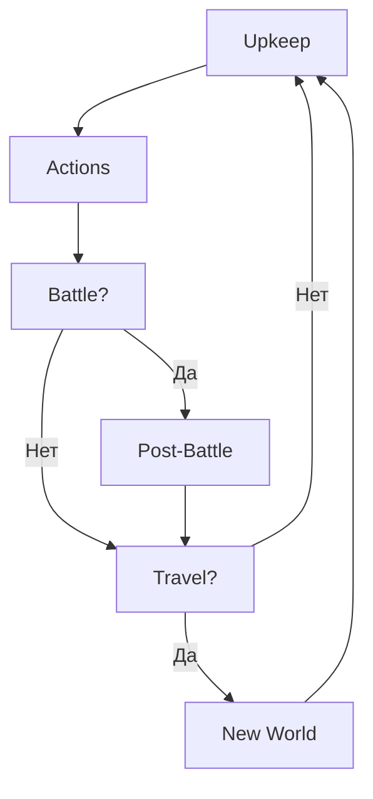

# 05. Кампания

[← Назад к оглавлению](./README.md)

---

## Фазы хода

---

## Экономика

| Ресурс | Источник | Использование |
|--------|----------|---------------|
| **Credits** | Миссии, торговля | Снаряжение, ремонт |
| **Story Points** | События | Реролы, спецдействия |
| **Rumors** | Задачи, лут | Квесты |

### Пример хода кампании

> **Ход 5. Экипаж на мире "Nova Prime"**

**1. Upkeep:**
- Долг: 0 cr
- Ремонт корабля: 0 (исправен)
- Лечение: Борис (2 хода рекавери) — пропускает

**2. Actions (задачи):**
| Персонаж | Задача | Результат |
|----------|--------|-----------|
| Алекс | Trade | Бросок 47: Trade Goods (+2 cr при продаже) |
| Карла | Find Patron | Успех! Новый патрон: Corporation |
| Дэн | Explore | Бросок 73: Local Maps (бонус к миссии) |

**3. Принятие миссии:**
- Патрон: Corporation, Danger Pay: 2 cr
- Тип: Secure (удержать зону 3 раунда)
- Hazard: Veteran Opposition (+1 Combat врагам)

**4. Battle:** (см. [02_Combat.md](./02_Combat.md))

**5. Post-Battle:**
- Ранения: Дэн (бросок 67) → Minor Injuries (1 ход)
- Лут: 2 rolls → Military Rifle, 3 credits
- XP: +1 всем выжившим, +1 Алексу за первое убийство

---

## Патроны

| Тип | Danger Pay | Особенности |
|-----|------------|-------------|
| Corporation | +1 | Высокая оплата |
| Government | 0 | Стандарт |
| Wealthy Individual | 0 | Стандарт |
| Secretive Group | 0 | +1 Time Frame |

---

## Миссии (11 типов)

| Тип | Цель | Победа |
|-----|------|--------|
| Access | Достичь точки | Персонаж на точке |
| Acquire | Забрать предмет | Унести с карты |
| Defend | Защитить зону | N раундов |
| Eliminate | Убить цель | Цель мертва |
| FightOff | Убить N врагов | N убито |
| Patrol | Обойти точки | Все посещены |
| Protect | Защитить VIP | VIP жив |

---

## Путешествие

| Бросок | Событие | Эффект |
|--------|---------|--------|
| 1-7 | Asteroids | Урон кораблю |
| 13-17 | Raided | Бой |
| 18-25 | Wreckage | Лут |
| 54-60 | Escape Pod | Рекрут? |
| 86-91 | Reflect | +XP |

---

[← Снаряжение](./04_Equipment.md) | [Далее: Вероятности →](./06_Probability.md)
