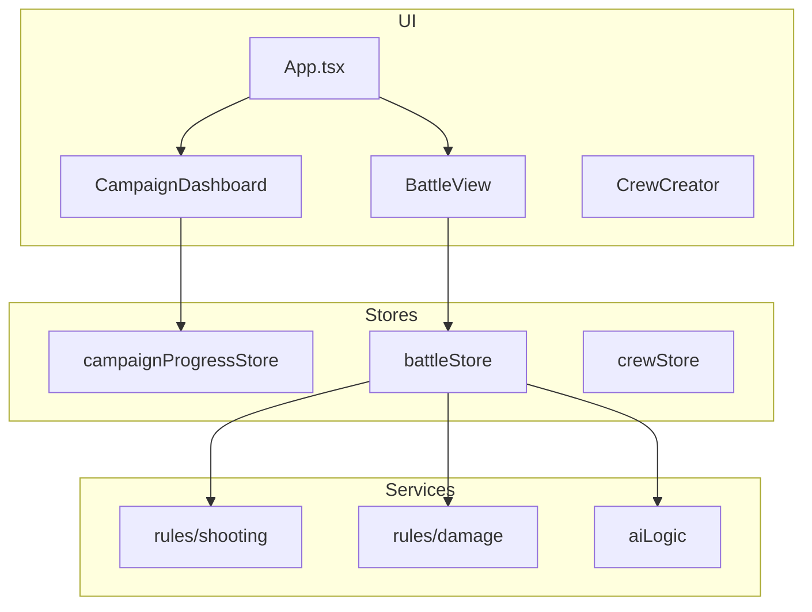

# 07. Техническая документация

[← Назад к оглавлению](./README.md)

---

## Технологии

| Компонент | Технология |
|-----------|------------|
| Frontend | React 18 + TypeScript |
| State | Zustand + Immer |
| Styling | Tailwind CSS |
| Build | Vite |
| Multiplayer | PeerJS (WebRTC) |
| AI | Gemini API |
| Tests | Vitest |

---

## Архитектура



---

## Stores

| Store | Назначение |
|-------|-----------|
| `useCampaignProgressStore` | Прогресс, save/load |
| `useBattleStore` | Боевое состояние |
| `useCrewStore` | Экипаж |
| `useMultiplayerStore` | PvP |
| `useShipStore` | Корабль |
| `useUiStore` | UI |

---

## Структура проекта

```
Skirmish-Sci-Fi/
├── components/
│   ├── battle/        # BattleGrid, BattleHUD
│   ├── campaign/      # Dashboard, Tasks
│   └── ui/            # Button, Card, Modal
├── constants/         # Данные игры
├── services/
│   ├── rules/         # shooting, damage, brawling
│   └── domain/        # battleDomain
├── stores/            # Zustand stores
├── types/             # TypeScript типы
└── locales/           # i18n
```

---

## Ключевые файлы

| Файл | Содержимое |
|------|------------|
| [`types/battle.ts`](file:///d:/Max/skirmish/Skirmish-Sci-Fi/types/battle.ts) | Типы боя |
| [`types/character.ts`](file:///d:/Max/skirmish/Skirmish-Sci-Fi/types/character.ts) | Типы персонажей |
| [`services/rules/damage.ts`](file:///d:/Max/skirmish/Skirmish-Sci-Fi/services/rules/damage.ts) | Логика урона |
| [`services/rules/shooting.ts`](file:///d:/Max/skirmish/Skirmish-Sci-Fi/services/rules/shooting.ts) | Логика стрельбы |
| [`constants/enemyEncounters.ts`](file:///d:/Max/skirmish/Skirmish-Sci-Fi/constants/enemyEncounters.ts) | Бестиарий |

---

## Локализация

- **Языки:** English, Русский
- **Формат:** JSON в `/locales/`

---

[← Вероятности](./06_Probability.md) | [Назад к оглавлению →](./README.md)
