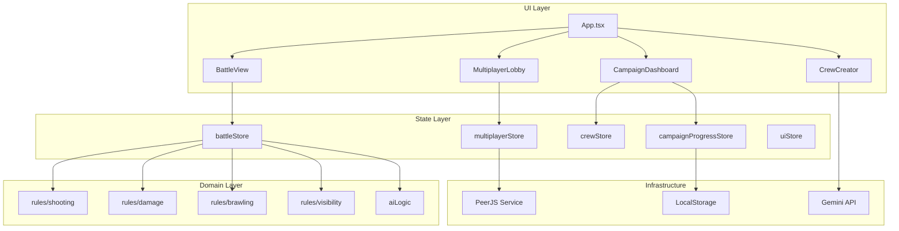

# 01. Архитектура

[← Назад](./README.md)

---

## Обзор архитектуры

Приложение использует **слоистую архитектуру** с чётким разделением ответственности:

```
┌─────────────────────────────────────────────────────┐
│                    UI Layer                          │
│   (React Components, Tailwind CSS)                   │
├─────────────────────────────────────────────────────┤
│                 State Layer                          │
│   (Zustand Stores: battle, campaign, crew, ui)       │
├─────────────────────────────────────────────────────┤
│               Application Layer                      │
│   (Use Cases, Orchestration)                         │
├─────────────────────────────────────────────────────┤
│                 Domain Layer                         │
│   (Business Rules: shooting, damage, brawling)       │
├─────────────────────────────────────────────────────┤
│              Infrastructure Layer                    │
│   (PeerJS, LocalStorage, Gemini API)                 │
└─────────────────────────────────────────────────────┘
```

---

## Диаграмма



---

## Принципы

1. **Unidirectional Data Flow** — данные текут сверху вниз
2. **Immutable Updates** — через Immer
3. **Domain Independence** — бизнес-логика не зависит от UI
4. **Separation of Concerns** — чёткое разделение слоёв

---

## Файловая структура

```
Skirmish-Sci-Fi/
├── components/           # UI компоненты
│   ├── battle/          # Боевые компоненты
│   ├── campaign/        # Компоненты кампании
│   ├── modals/          # Модальные окна
│   └── ui/              # Переиспользуемые UI элементы
├── constants/           # Статические данные игры
├── context/             # React Context (Theme, Toast)
├── hooks/               # Custom React hooks
├── i18n/                # Интернационализация
├── locales/             # Переводы
├── services/            # Бизнес-логика
│   ├── application/     # Use cases
│   ├── domain/          # Domain logic
│   ├── rules/           # Game rules
│   ├── traits/          # Trait system handlers
│   └── utils/           # Утилиты
├── stores/              # Zustand stores
├── types/               # TypeScript типы
├── App.tsx              # Entry component
└── index.tsx            # Entry point
```

---

## Зависимости между модулями

| Модуль | Зависит от |
|--------|------------|
| `components/` | `stores/`, `hooks/`, `types/` |
| `stores/` | `services/`, `types/` |
| `services/rules/` | `types/`, `constants/` |
| `services/domain/` | `types/` |
| `constants/` | `types/` |

---

[Далее: Модели данных →](./02_DataModels.md)
