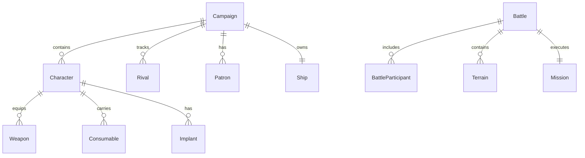

# 02. Модели данных

[← Назад](./README.md)

---

## Основные типы

### Character

```typescript
// types/character.ts
interface Character {
  id: string;
  name: string;
  pronouns: string;
  raceId: RaceId;
  backgroundId: string;
  motivationId: string;
  classId: string;
  stats: CharacterStats;
  xp: number;
  
  // Equipment
  weapons: CharacterWeapon[];
  armor?: string;
  screen?: string;
  consumables: string[];
  implants: string[];
  utilityDevices: string[];
  
  // Battle state
  position: Position;
  status: ParticipantStatus;  // 'active' | 'stunned' | 'casualty'
  stunTokens: number;
  currentLuck: number;
  actionsRemaining: number;
  activeEffects: ActiveEffect[];
}
```

### CharacterStats

```typescript
interface CharacterStats {
  reactions: number;   // 1-4
  speed: number;       // 3-7
  combat: number;      // 0-3
  toughness: number;   // 2-6
  savvy: number;       // 0-3
  luck: number;        // 0-3
}
```

### Battle

```typescript
// types/battle.ts
interface Battle {
  id: string;
  participants: BattleParticipant[];
  gridSize: { width: number; height: number };
  terrain: Terrain[];
  mission: Mission;
  round: number;
  phase: BattlePhase;
  
  // Turn order
  quickActionOrder: string[];
  slowActionOrder: string[];
  activeParticipantId: string | null;
  
  // Special state
  deploymentCondition?: DeploymentCondition;
  notableSight?: NotableSightResult;
}
```

### Campaign

```typescript
// types/campaign.ts
interface Campaign {
  turn: number;
  credits: number;
  storyPoints: number;
  debt: number;
  
  rivals: Rival[];
  patrons: Patron[];
  questRumors: Rumor[];
  
  ship: Ship | null;
  stash: Stash;
  currentWorld: World | null;
  
  activeMission: ActiveMission | null;
  activeQuest: Quest | null;
}
```

---

## Weapon

```typescript
// types/items.ts
interface Weapon {
  id: string;
  range: number | 'brawl';
  shots: number;
  damage: number;
  traits: string[];
}
```

### Weapon Traits

| Trait | Эффект |
|-------|--------|
| `pistol` | Можно стрелять в brawl |
| `melee` | Только ближний бой |
| `critical` | 6 = критическое |
| `piercing` | Игнорирует броню |
| `heavy` | Штраф после движения |
| `area` | Area of Effect |
| `stun` | Оглушение |
| `snap_shot` | Нет штрафа после движения |

---

## Terrain

```typescript
interface Terrain {
  id: string;
  name: string;
  type: TerrainType;  // 'Linear' | 'Block' | 'Area' | etc.
  position: Position;
  size: { width: number; height: number };
  
  isDifficult: boolean;
  providesCover: boolean;
  blocksLineOfSight: boolean;
  isImpassable: boolean;
}
```

---

## Relationships



---

[← Архитектура](./01_Architecture.md) | [Далее: State Management →](./03_StateManagement.md)
