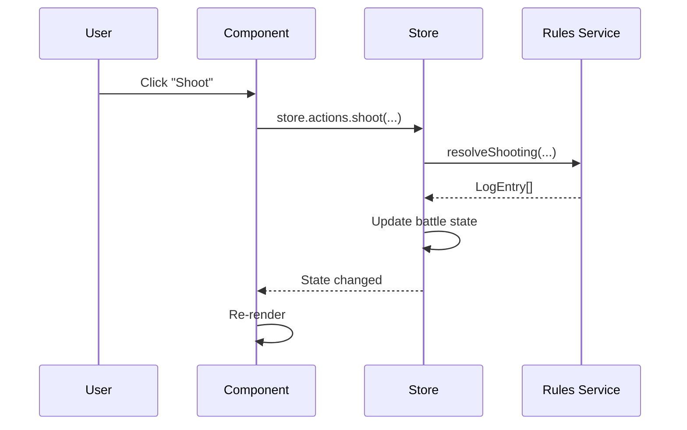

# 03. State Management

[← Назад](./README.md)

---

## Обзор

Приложение использует **Zustand** с **Immer** для immutable updates.

```typescript
import { create } from 'zustand';
import { immer } from 'zustand/middleware/immer';
import { persist } from 'zustand/middleware';
```

---

## Stores

### campaignProgressStore

**Файл:** `stores/campaignProgressStore.ts`

```typescript
interface CampaignProgressState {
  campaign: CampaignProgressData | null;
  isHydrated: boolean;
  saveSlots: SaveSlots;
  
  actions: {
    startCampaign: (crew: Crew, campaign: Campaign) => void;
    resetGame: () => void;
    loadGame: (slotId: SlotId) => void;
    saveGame: (slotId: SlotId) => void;
    
    // Turn management
    startNewCampaignTurn: () => void;
    finalizeUpkeep: (payments) => void;
    finalizeTasks: () => void;
    
    // Economy
    addCredits: (amount: number) => void;
    spendCredits: (amount: number) => void;
    sellItem: (sourceId, itemId, itemType) => void;
    
    // Battle integration
    resolvePostBattleActivity: (type, battle) => void;
  };
}
```

### battleStore

**Файл:** `stores/battleStore.ts`

```typescript
interface BattleState {
  battle: Battle | null;
  selectedCharacterId: string | null;
  uiState: PlayerActionUIState;
  animationState: AnimationState;
  
  actions: {
    initBattle: (config) => void;
    selectCharacter: (id: string) => void;
    
    // Actions
    moveCharacter: (id, position, isDash) => void;
    shoot: (attackerId, targetId, weaponId, isAimed) => void;
    brawl: (attackerId, targetId, weaponId?) => void;
    useConsumable: (characterId, consumableId) => void;
    
    // Phase management
    rollInitiative: () => void;
    advancePhase: () => void;
    endTurn: (characterId) => void;
    
    // AI
    executeEnemyTurn: () => void;
  };
}
```

### crewStore

**Файл:** `stores/crewStore.ts`

```typescript
interface CrewState {
  crew: Crew | null;
  
  actions: {
    setCrew: (crew: Crew) => void;
    updateCharacter: (id, updates) => void;
    addMember: (character: Character) => void;
    removeMember: (id: string) => void;
    
    // Equipment
    equipWeapon: (characterId, weapon) => void;
    unequipWeapon: (characterId, instanceId) => void;
    
    // Task assignment
    assignTask: (characterId, task: TaskType) => void;
  };
}
```

---

## State Flow



---

## Persistence

```typescript
// campaignProgressStore uses persist middleware
persist(
  immer((set, get) => ({ ... })),
  {
    name: 'five-parsecs-campaign',
    storage: createJSONStorage(() => localStorage),
    partialize: (state) => ({
      campaign: state.campaign,
      saveSlots: state.saveSlots,
    }),
  }
)
```

---

[← Модели данных](./02_DataModels.md) | [Далее: Services →](./04_Services.md)
