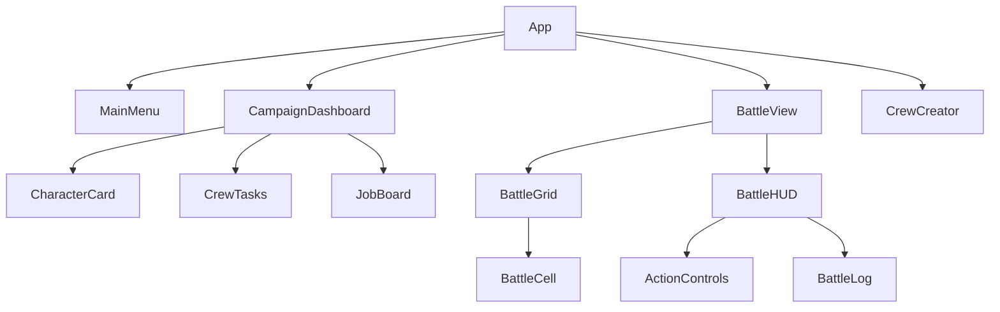

# 05. Components

[← Назад](./README.md)

---

## Структура

```
components/
├── battle/
│   ├── BattleView.tsx      # Main battle container
│   ├── BattleGrid.tsx      # Grid rendering
│   ├── BattleCell.tsx      # Individual cell
│   ├── BattleHUD.tsx       # HUD layout
│   ├── ActionControls.tsx  # Action buttons
│   ├── BattleLog.tsx       # Combat log
│   └── CharacterStatus.tsx # Selected character info
├── campaign/
│   ├── CampaignDashboard.tsx
│   ├── CrewTasks.tsx
│   └── JobBoard.tsx
├── ui/
│   ├── Button.tsx
│   ├── Card.tsx
│   ├── Modal.tsx
│   └── Tooltip.tsx
└── MainMenu.tsx
```

---

## Battle Components

### BattleView

Главный контейнер боя.

```tsx
function BattleView() {
  const battle = useBattleStore(s => s.battle);
  
  return (
    <div className="battle-container">
      <BattleGrid />
      <BattleHUD />
      <AnimationLayer />
    </div>
  );
}
```

### BattleGrid

Рендерит сетку с terrain и участниками.

```tsx
interface BattleGridProps {
  onCellClick: (pos: Position) => void;
}

// Использует useMemo для оптимизации
const cells = useMemo(() => 
  generateCells(battle, validMoves, validTargets),
  [battle, validMoves, validTargets]
);
```

### ActionControls

Кнопки действий для выбранного персонажа.

```tsx
function ActionControls() {
  const selectedId = useBattleStore(s => s.selectedCharacterId);
  const uiState = useBattleStore(s => s.uiState);
  
  // Показывает доступные действия
  return (
    <div className="action-controls">
      <Button onClick={handleMove}>Move</Button>
      <Button onClick={handleShoot}>Shoot</Button>
      <Button onClick={handleBrawl}>Brawl</Button>
      <Button onClick={handleEndTurn}>End Turn</Button>
    </div>
  );
}
```

---

## Campaign Components

### CampaignDashboard

Главный экран кампании.

```tsx
function CampaignDashboard() {
  return (
    <div className="campaign-dashboard-grid">
      <section className="main-area">
        <CrewTasks />
        <JobBoard />
      </section>
      <section className="side-area">
        <ResourcePanel />
        <ShipStatus />
      </section>
      <section className="roster-area">
        {crew.members.map(c => <CharacterCard key={c.id} character={c} />)}
      </section>
    </div>
  );
}
```

---

## UI Components

### Button

```tsx
interface ButtonProps {
  variant?: 'primary' | 'secondary' | 'danger';
  size?: 'sm' | 'md' | 'lg';
  disabled?: boolean;
  onClick: () => void;
  children: React.ReactNode;
}
```

### Modal

```tsx
interface ModalProps {
  isOpen: boolean;
  onClose: () => void;
  title: string;
  children: React.ReactNode;
}
```

---

## Component Hierarchy



---

[← Services](./04_Services.md) | [Далее: Multiplayer →](./06_Multiplayer.md)
