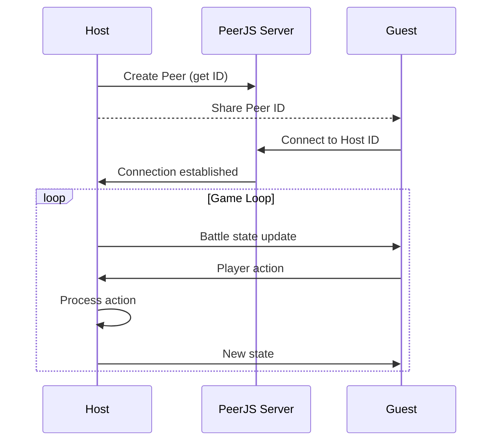
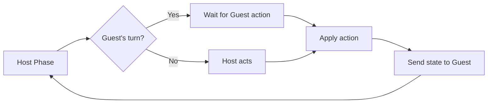

# 06. Multiplayer

[← Назад](./README.md)

---

## Архитектура

Мультиплеер реализован через **WebRTC** с использованием **PeerJS**.



---

## MultiplayerStore

```typescript
// stores/multiplayerStore.ts
interface MultiplayerState {
  peer: Peer | null;
  connection: DataConnection | null;
  role: 'host' | 'guest' | null;
  peerId: string | null;
  isConnected: boolean;
  
  actions: {
    initAsHost: () => Promise<string>;
    connectAsGuest: (hostId: string) => Promise<void>;
    sendAction: (action: PlayerAction) => void;
    disconnect: () => void;
  };
}
```

---

## Синхронизация

### Host → Guest
- Отправляет полное состояние `Battle`
- После каждого действия

### Guest → Host
- Отправляет только `PlayerAction`
- Host валидирует и применяет

```typescript
type MultiplayerMessage =
  | { type: 'battle_state'; payload: Battle }
  | { type: 'player_action'; payload: PlayerAction }
  | { type: 'sync_request' }
  | { type: 'game_over'; winner: 'host' | 'guest' };
```

---

## Turn Management



---

[← Components](./05_Components.md) | [Далее: Testing →](./07_Testing.md)
