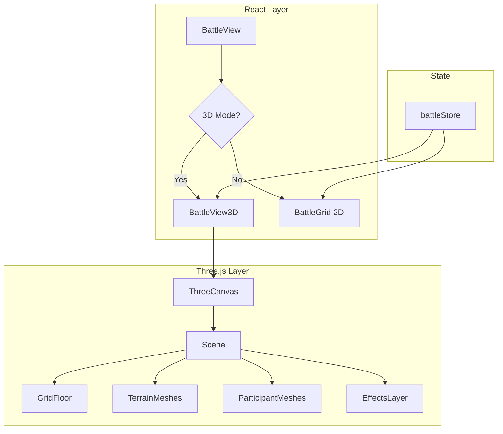

# 08. Three.js Rendering Layer

[← Назад](./README.md)

---

## Архитектура 3D-слоя



---

## Формат данных для 3D

### Unit3D

```typescript
interface Unit3D {
  id: string;
  position: { x: number; y: number; z: number };
  rotation: number; // радианы, вокруг Y
  modelType: 'player' | 'enemy' | 'bot';
  animationState: AnimationState3D;
  status: ParticipantStatus;
  isSelected: boolean;
  stunTokens: number;
}

type AnimationState3D = 
  | 'idle' 
  | 'run' 
  | 'shoot' 
  | 'melee' 
  | 'hit' 
  | 'stun'
  | 'dead';
```

### Terrain3D

```typescript
interface Terrain3D {
  id: string;
  type: TerrainType;
  position: { x: number; y: number };
  size: { width: number; height: number };
  height: number; // 0.5 = low, 1.5 = medium, 3 = tall
  geometry: 'box' | 'cylinder' | 'sphere' | 'custom';
  material: 'metal' | 'concrete' | 'rock' | 'organic';
}
```

---

## Система событий

Three.js-слой подписывается на события из battleStore:

| Событие | Payload | 3D Реакция |
|---------|---------|-----------|
| `participant_moved` | { id, path: Position[] } | Анимация движения |
| `shot_fired` | { from, to, hit } | Laser линия + impact |
| `damage_taken` | { id, isLethal } | Hit flash, fall animation |
| `stun_applied` | { id, tokens } | Stagger + icons |
| `participant_died` | { id } | Death animation |

```typescript
// Подписка в ThreeCanvas
useEffect(() => {
  const unsubscribe = useBattleStore.subscribe(
    (state) => state.animation,
    (animation) => {
      if (animation?.type === 'move') {
        animateMove(animation.participantId, animation.path);
      }
    }
  );
  return unsubscribe;
}, []);
```

---

## Камера

| Параметр | Значение |
|----------|----------|
| **Тип** | PerspectiveCamera |
| **Угол** | Изометрический (~45°) |
| **Controls** | OrbitControls |
| **Zoom** | 5-50 units |
| **Pan limits** | Grid bounds + margin |

```typescript
<OrbitControls
  enablePan={true}
  enableZoom={true}
  enableRotate={true}
  minDistance={5}
  maxDistance={50}
  maxPolarAngle={Math.PI / 2.2} // не ниже горизонта
  touches={{
    ONE: THREE.TOUCH.ROTATE,
    TWO: THREE.TOUCH.DOLLY_PAN
  }}
/>
```

---

## Low-poly модели

### Персонажи (процедурные)

```typescript
const PlayerMesh = () => (
  <group>
    {/* Тело */}
    <mesh position={[0, 0.5, 0]}>
      <cylinderGeometry args={[0.3, 0.4, 1, 8]} />
      <meshStandardMaterial color="#4a90d9" />
    </mesh>
    {/* Голова */}
    <mesh position={[0, 1.2, 0]}>
      <sphereGeometry args={[0.25, 8, 6]} />
      <meshStandardMaterial color="#f0d9b5" />
    </mesh>
  </group>
);
```

### Terrain Mapping

| Terrain Name | Geometry | Height | Material |
|--------------|----------|--------|----------|
| Building | Box | 3 | concrete |
| Container | Box | 1.5 | metal |
| Barrel | Cylinder | 1 | metal |
| Hill | SphereHalf | 1 | rock |
| Rubble | RandomBoxes | 0.5 | concrete |

---

## Освещение

```typescript
<ambientLight intensity={0.4} />
<directionalLight
  position={[10, 20, 10]}
  intensity={1}
  castShadow
  shadow-mapSize={[2048, 2048]}
/>
```

---

## Интерактивность

### Raycasting

```typescript
const handleClick = (event) => {
  const intersects = raycaster.intersectObjects(scene.children);
  const hit = intersects.find(i => i.object.userData.type === 'cell');
  if (hit) {
    const pos = hit.object.userData.position;
    handlers.handleGridClick(pos);
  }
};
```

### Hover подсветка

```typescript
const [hoveredCell, setHoveredCell] = useState<Position | null>(null);

// В GridFloor
{hoveredCell && (
  <mesh position={[hoveredCell.x, 0.01, hoveredCell.y]}>
    <planeGeometry args={[1, 1]} />
    <meshBasicMaterial color="#ffffff" opacity={0.3} transparent />
  </mesh>
)}
```

---

## Новые файлы

| Файл | Описание |
|------|----------|
| `components/battle/three/ThreeCanvas.tsx` | Canvas wrapper |
| `components/battle/three/GridFloor.tsx` | Пол с сеткой |
| `components/battle/three/TerrainMesh.tsx` | 3D terrain |
| `components/battle/three/ParticipantMesh.tsx` | 3D юниты |
| `components/battle/three/CameraController.tsx` | Камера |
| `components/battle/BattleView3D.tsx` | 3D версия BattleView |

---

[← Testing](./07_Testing.md) | [Назад к оглавлению →](./README.md)
