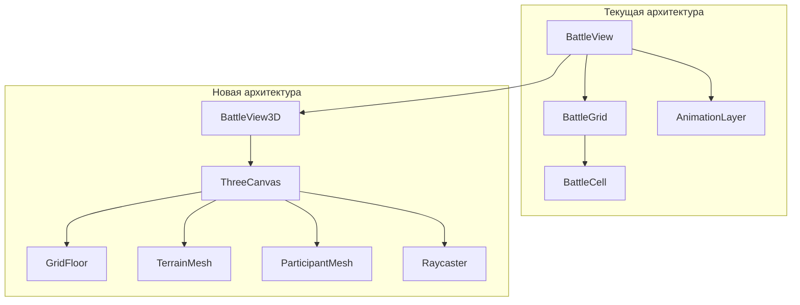

# План миграции на Three.js

## Описание проблемы

Текущая реализация использует 2D CSS Grid + SVG анимации. Цель — добавить 3D-визуализацию боя через Three.js с сохранением существующей функциональности.

---

## Анализ текущей архитектуры

### Компоненты рендеринга

| Компонент | Функция | Строки |
|-----------|---------|--------|
| `BattleView.tsx` | Оркестратор | 89 |
| `BattleGrid.tsx` | CSS Grid рендер | 326 |
| `BattleCell.tsx` | Отдельная ячейка | 176 |
| `AnimationLayer.tsx` | SVG анимации | 147 |

### Зависимости (package.json)
- React 19, Zustand 5, Vite 5
- **Нет Three.js** — требуется добавить

### Terrain Generator
- 28 генераторов terrain features
- Типы: Building, Container, Hill, Rubble, etc.
- Позиции в grid координатах (x, y)

---

## Предлагаемые изменения

### Фаза 1: Инфраструктура

#### [NEW] `components/battle/ThreeCanvas.tsx`
- React Three Fiber canvas wrapper
- OrbitControls для камеры
- Lighting setup

#### [MODIFY] `package.json`
- Добавить: `three`, `@react-three/fiber`, `@react-three/drei`

---

### Фаза 2: 3D Terrain

#### [NEW] `components/battle/three/TerrainMesh.tsx`
- 3D представление terrain объектов
- Mapping terrain types → 3D геометрии

#### [NEW] `components/battle/three/GridFloor.tsx`
- Плоскость пола с grid текстурой
- Подсветка доступных ячеек

---

### Фаза 3: 3D Участники

#### [NEW] `components/battle/three/ParticipantMesh.tsx`
- 3D модели персонажей/врагов
- Анимации idle/move/attack
- Статус индикаторы (stun tokens, effects)

---

### Фаза 4: Интерактивность

#### [NEW] `components/battle/three/Raycaster.tsx`
- Клики по 3D объектам
- Hover подсветка

#### [MODIFY] `hooks/useBattleLogic.ts`
- Адаптировать handleGridClick для 3D координат

---

### Фаза 5: Переключатель 2D/3D

#### [MODIFY] `BattleView.tsx`
- Добавить toggle 2D ↔ 3D
- Сохранить выбор в localStorage

#### [NEW] `components/battle/BattleView3D.tsx`
- 3D версия BattleView

---

## Диаграмма архитектуры



---

## План верификации

### Автоматические тесты

```bash
# Существующие тесты (проверить что не сломано)
npm test
```

### Ручное тестирование

1. **Переключатель 2D/3D:**
   - Открыть бой
   - Нажать кнопку переключения
   - Убедиться что отображается 3D сцена

2. **3D Terrain:**
   - Проверить что все типы terrain отображаются
   - Вращение камеры работает

3. **3D Интерактивность:**
   - Клик по персонажу выделяет его
   - Клик по ячейке для перемещения работает

4. **Производительность:**
   - 60 FPS на средней машине
   - Нет утечек памяти при переключении

---

## Оценка сложности

| Фаза | Сложность | Часы |
|------|-----------|------|
| Инфраструктура | Низкая | 2-3 |
| 3D Terrain | Средняя | 4-6 |
| 3D Участники | Высокая | 6-8 |
| Интерактивность | Средняя | 4-5 |
| Переключатель | Низкая | 1-2 |
| **Итого** | | **17-24** |

---

## Риски

> [!WARNING]
> **Производительность**
> Large grids (20x20) с множеством terrain могут тормозить. Требуется LOD и instancing.

> [!CAUTION]
> **Мультиплеер**
> Синхронизация 3D анимаций между игроками требует дополнительной работы.

---

## Решения по дизайну

| Вопрос | Решение |
|--------|---------|
| **Приоритет** | Начать с базового 3D, анимации добавить позже |
| **Стиль** | Low-poly минимализм |
| **Мобильные** | ✅ Touch-управление обязательно |
| **Модели** | Процедурные примитивы + AI-генерация |

---

## Подход к моделям

### Процедурные примитивы (Phase 1)
```typescript
// Пример: персонаж из примитивов
const CharacterMesh = () => (
  <group>
    <mesh position={[0, 0.5, 0]}> {/* Тело */}
      <cylinderGeometry args={[0.3, 0.4, 1, 8]} />
      <meshStandardMaterial color="#4a90d9" />
    </mesh>
    <mesh position={[0, 1.2, 0]}> {/* Голова */}
      <sphereGeometry args={[0.25, 8, 6]} />
      <meshStandardMaterial color="#f0d9b5" />
    </mesh>
  </group>
);
```

### AI-генерация (Phase 2+)
- **Copilot 3D** — генерация .glb моделей по описанию
- **Meshy.ai** или **Tripo3D** — text-to-3D для ассетов
- **Blender + AI плагины** — доработка сгенерированных моделей

### Terrain из примитивов
| Terrain | Геометрия |
|---------|-----------|
| Building | Box + плоская крыша |
| Container | Box с отступами |
| Barrel | Cylinder |
| Hill | Сфера, срезанная снизу |
| Rubble | Случайные Box меньшего размера |

---

## Touch-управление

```typescript
// Добавить в ThreeCanvas.tsx
import { OrbitControls } from '@react-three/drei';

<OrbitControls 
  enablePan={true}
  enableZoom={true}
  enableRotate={true}
  touches={{
    ONE: THREE.TOUCH.ROTATE,
    TWO: THREE.TOUCH.DOLLY_PAN
  }}
/>
```

| Жест | Действие |
|------|----------|
| 1 палец drag | Вращение камеры |
| 2 пальца pinch | Zoom |
| 2 пальца drag | Pan |
| Tap | Выбор объекта |
