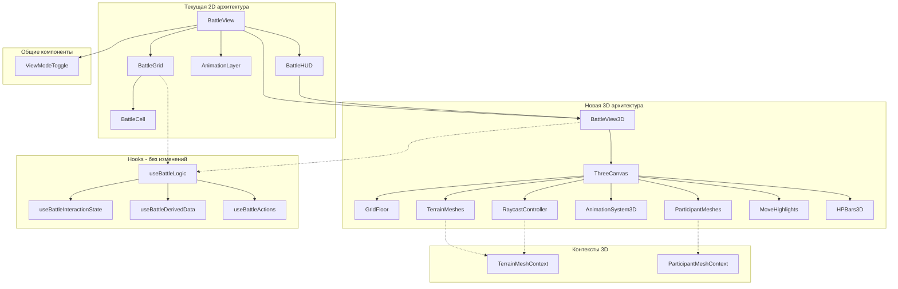

# План миграции на Three.js v2.0

## Обзор

Цель — добавить опциональную 3D-визуализацию боя через Three.js с сохранением существующей 2D функциональности. Пользователь сможет переключаться между режимами.

**Обновлено на основе ревью:** Исправлены критические ошибки API, добавлены недостающие компоненты, переоценен bundle size (600-800KB), реорганизован порядок фаз.

---

## Текущая архитектура

### Компоненты рендеринга боя

| Компонент | Функция | Путь |
|-----------|---------|------|
| `BattleView.tsx` | Оркестратор боевого экрана | `components/battle/` |
| `BattleGrid.tsx` | CSS Grid рендер карты | `components/battle/` |
| `BattleCell.tsx` | Отдельная ячейка сетки | `components/battle/` |
| `AnimationLayer.tsx` | SVG анимации поверх сетки | `components/battle/` |
| `BattleHUD.tsx` | UI панели и контролы | `components/battle/` |

### Хуки боевой логики

| Хук | Функция |
|-----|---------|
| `useBattleLogic` | Композитный хук, объединяющий всю UI логику |
| `useBattleInteractionState` | Состояние взаимодействия: выбор, hover, режим действия |
| `useBattleDerivedData` | Вычисляемые данные: доступные ходы, цели |
| `useBattleActions` | Обработчики действий: клик, перемещение, атака |
| `useBattleAutomations` | Автоматизация: центрирование камеры, авто-ход AI |

### State Management

| Store | Функция |
|-------|---------|
| `battleStore` | Состояние боя: участники, terrain, фаза |
| `multiplayerStore` | Мультиплеер: роль, синхронизация |
| `uiStore` | UI состояние: модалки, тосты |

### Terrain система

**Типы terrain** из `types/battle.ts`:
- `Linear` — линейные объекты: заборы, стены, баррикады
- `Individual` — отдельные объекты: бочки, статуи, оборудование
- `Area` — области: холмы, руины
- `Field` — поля: болота
- `Block` — блоки: контейнеры, здания
- `Interior` — интерьеры зданий
- `Door` — двери

**Генераторы terrain** из `terrainGenerator.ts` — 28+ типов:

| Категория | Типы |
|-----------|------|
| Здания | `Building`, `Large Structure`, `Control Tower`, `Wall`, `Door`, `Interior` |
| Контейнеры | `Container`, `Cargo Area` |
| Препятствия | `Barricade`, `Fence Post`, `Ruined Wall`, `Wreckage Line` |
| Природа | `Hill`, `Rock Ridge`, `Swamp`, `Crystal` |
| Объекты | `Barrel`, `Equipment`, `Machinery`, `Vehicle`, `Statue`, `Sign Post` |
| Области | `Landing Pad`, `Rubble`, `Scatter` |

### Зависимости

Текущие из `package.json`:
- React 19.1, Zustand 5.0, Vite 5.2
- **Нет Three.js**

Новые зависимости с tree-shaking:
```json
{
  "dependencies": {
    "three": "^0.170.0",
    "@react-three/fiber": "^8.17.0",
    "@react-three/drei": "^9.117.0"
  },
  "devDependencies": {
    "@types/three": "^0.170.0",
    "@react-three/test-renderer": "^8.17.0"
  }
}
```

---

## Координатная система

### Константы

```typescript
// constants/three.ts
export const TILE_SIZE = 1; // 1 unit = 1 grid cell
export const TILE_HEIGHT = 0.1; // Высота пола
export const WALL_HEIGHT = 2; // Высота стен
export const CHARACTER_HEIGHT = 1.5; // Высота персонажа
export const MOVE_SPEED = 3; // units per second for animations
```

### Преобразование координат

```typescript
// services/three/coordinates.ts

/**
 * Grid origin: top-left corner at (0, 0)
 * World origin: center of the map at (0, 0, 0)
 *
 * Grid X → World X (left to right)
 * Grid Y → World Z (top to bottom)
 * World Y = height (up)
 */

export const gridToWorld = (
  gridPos: Position,
  gridSize: GridSize,
  height: number = 0
): Vector3 => ({
  x: (gridPos.x - gridSize.width / 2 + 0.5) * TILE_SIZE,
  y: height,
  z: (gridPos.y - gridSize.height / 2 + 0.5) * TILE_SIZE,
});

export const worldToGrid = (
  worldPos: Vector3,
  gridSize: GridSize
): Position => ({
  x: Math.floor(worldPos.x / TILE_SIZE + gridSize.width / 2),
  y: Math.floor(worldPos.z / TILE_SIZE + gridSize.height / 2),
});

// Проверка валидности grid позиции
export const isValidGridPos = (pos: Position, gridSize: GridSize): boolean =>
  pos.x >= 0 && pos.x < gridSize.width &&
  pos.y >= 0 && pos.y < gridSize.height;
```

### Диаграмма координат

```
Grid Space (2D)              World Space (3D)
┌───┬───┬───┬───┐
│0,0│1,0│2,0│3,0│            Y (up)
├───┼───┼───┼───┤            │
│0,1│1,1│2,1│3,1│            │    Z (grid Y)
├───┼───┼───┼───┤            │   /
│0,2│1,2│2,2│3,2│            │  /
├───┼───┼───┼───┤            │ /
│0,3│1,3│2,3│3,3│            └──────── X (grid X)
└───┴───┴───┴───┘
                            World center = grid center
                            For 4x4 grid: (1.5, 1.5) → (0, 0, 0)
```

---

## Архитектура решения

### Диаграмма компонентов



### Принцип интеграции

**Ключевая идея**: 3D компоненты используют те же хуки и store, что и 2D. Меняется только рендеринг.

```typescript
// BattleView3D использует тот же useBattleLogic
const BattleView3D: React.FC = () => {
  const battleLogic = useBattleLogic();
  // ... рендер Three.js сцены с теми же данными
};
```

---

## Реорганизованный порядок фаз

### Фаза 1: Инфраструктура + Минимальный Terrain

**Цель:** Получить рабочую 3D сцену с базовым terrain, чтобы убедиться в корректности координат.

#### Задачи
- [ ] Добавить зависимости в `package.json` с tree-shaking
- [ ] Создать исправленный `ThreeCanvas.tsx` с правильным API
- [ ] Создать `ViewModeToggle.tsx` с блокировкой во время анимации
- [ ] Модифицировать `BattleView.tsx` для условного рендеринга
- [ ] Создать `BattleView3D.tsx` скелет
- [ ] Создать `GridFloor.tsx` с базовой плоскостью
- [ ] Создать минимальный `TerrainMesh.tsx` для Wall типа
- [ ] Реализовать `TerrainMeshContext` для регистрации meshes

#### Новые файлы

**`components/battle/three/ThreeCanvas.tsx`** (исправленный)
```typescript
import { Canvas, useFrame } from '@react-three/fiber';
import { OrbitControls, PerspectiveCamera } from '@react-three/drei';
import { useRef, useCallback } from 'react';
import type { OrbitControls as OrbitControlsImpl } from 'three-stdlib';
import * as THREE from 'three';

interface ThreeCanvasProps {
  children: React.ReactNode;
  gridSize: { width: number; height: number };
}

// Константы камеры
const CAMERA_CONFIG = {
  minDistance: 5,
  maxDistance: 40,
  minPolarAngle: 0.3,           // Не смотреть снизу
  maxPolarAngle: Math.PI / 2.2, // Не смотреть под карту
  initialHeight: 15,
  initialDistance: 15,
};

// Утилита clamp
const clamp = (value: number, min: number, max: number) =>
  Math.max(min, Math.min(max, value));

// Внутренний компонент для ограничения pan через useFrame
const CameraController: React.FC<{ panLimit: number }> = ({ panLimit }) => {
  const controlsRef = useRef<OrbitControlsImpl>(null);

  useFrame(() => {
    if (controlsRef.current) {
      const target = controlsRef.current.target;
      target.x = clamp(target.x, -panLimit, panLimit);
      target.z = clamp(target.z, -panLimit, panLimit);
    }
  });

  return (
    <OrbitControls
      ref={controlsRef}
      enablePan={true}
      enableZoom={true}
      enableRotate={true}
      enableDamping={true}
      dampingFactor={0.05}
      minDistance={CAMERA_CONFIG.minDistance}
      maxDistance={CAMERA_CONFIG.maxDistance}
      minPolarAngle={CAMERA_CONFIG.minPolarAngle}
      maxPolarAngle={CAMERA_CONFIG.maxPolarAngle}
      // Исправлено: правильные числовые значения для touch
      touches={{
        ONE: 1, // ROTATE
        TWO: 6  // DOLLY_PAN
      }}
    />
  );
};

export const ThreeCanvas: React.FC<ThreeCanvasProps> = ({ children, gridSize }) => {
  const panLimit = Math.max(gridSize.width, gridSize.height) / 2 + 2;

  // Обработка WebGL context loss
  const handleCreated = useCallback(({ gl }: { gl: THREE.WebGLRenderer }) => {
    gl.domElement.addEventListener('webglcontextlost', (e) => {
      e.preventDefault();
      console.error('WebGL context lost. Please refresh the page.');
      // TODO: показать UI уведомление пользователю
    });

    gl.domElement.addEventListener('webglcontextrestored', () => {
      console.log('WebGL context restored');
    });
  }, []);

  return (
    <Canvas
      shadows
      resize={{ scroll: false, debounce: { scroll: 50, resize: 0 } }}
      onCreated={handleCreated}
    >
      <PerspectiveCamera
        makeDefault
        position={[0, CAMERA_CONFIG.initialHeight, CAMERA_CONFIG.initialDistance]}
      />
      <CameraController panLimit={panLimit} />
      <ambientLight intensity={0.4} />
      <directionalLight position={[10, 20, 10]} intensity={0.8} castShadow />
      {children}
    </Canvas>
  );
};
```

**`components/battle/three/contexts/TerrainMeshContext.tsx`**
```typescript
import React, { createContext, useContext, useRef } from 'react';
import * as THREE from 'three';

interface TerrainMeshContextType {
  register: (id: string, mesh: THREE.Mesh) => void;
  unregister: (id: string) => void;
  getMeshes: () => THREE.Mesh[];
}

const TerrainMeshContext = createContext<TerrainMeshContextType | null>(null);

export const TerrainMeshProvider: React.FC<{ children: React.ReactNode }> = ({ children }) => {
  const meshesRef = useRef<Map<string, THREE.Mesh>>(new Map());

  const contextValue: TerrainMeshContextType = {
    register: (id: string, mesh: THREE.Mesh) => {
      meshesRef.current.set(id, mesh);
    },
    unregister: (id: string) => {
      meshesRef.current.delete(id);
    },
    getMeshes: () => Array.from(meshesRef.current.values()),
  };

  return (
    <TerrainMeshContext.Provider value={contextValue}>
      {children}
    </TerrainMeshContext.Provider>
  );
};

export const useTerrainMeshContext = () => {
  const context = useContext(TerrainMeshContext);
  if (!context) {
    throw new Error('useTerrainMeshContext must be used within TerrainMeshProvider');
  }
  return context;
};
```

**`components/battle/BattleView3D.tsx`** (скелет)
```typescript
import { useMemo } from 'react';
import { ThreeCanvas } from './three/ThreeCanvas';
import { GridFloor } from './three/GridFloor';
import { TerrainMesh } from './three/TerrainMesh';
import { RaycastController } from './three/RaycastController';
import { TerrainMeshProvider } from './three/contexts/TerrainMeshContext';
import BattleHUD from './BattleHUD';
import type { BattleLogic } from '@/hooks/useBattleLogic';
import { useBattleStore } from '@/stores';

interface BattleView3DProps {
  battleLogic: BattleLogic;
}

export const BattleView3D: React.FC<BattleView3DProps> = ({ battleLogic }) => {
  const { derived } = battleLogic;

  // Данные из store
  const battle = useBattleStore(state => state.battle);

  if (!battle) return null;

  const { participants, terrain, gridSize } = battle;

  return (
    <div className="relative w-full h-full">
      <TerrainMeshProvider>
        <ThreeCanvas gridSize={gridSize}>
          {/* Пол с сеткой */}
          <GridFloor gridSize={gridSize} />

          {/* Terrain объекты */}
          {terrain.map(t => (
            <TerrainMesh key={t.id} terrain={t} gridSize={gridSize} />
          ))}

          {/* Обработка кликов */}
          <RaycastController
            battleLogic={battleLogic}
            gridSize={gridSize}
          />
        </ThreeCanvas>
      </TerrainMeshProvider>

      {/* HUD рендерится поверх как обычный React */}
      <BattleHUD battleLogic={battleLogic} />
    </div>
  );
};

export default BattleView3D;
```

### Фаза 2: Интерактивность (Picking Plane)

**Цель:** Реализовать клики по карте. Это критично — без этого всё остальное бесполезно.

#### Задачи
- [ ] Создать `RaycastController` с Picking Plane
- [ ] Реализовать `onCellClick` и `onCellHover` с throttling
- [ ] Протестировать точность кликов по grid

#### Новые файлы

**`components/battle/three/RaycastController.tsx`**
```typescript
import { useRef, useCallback, useMemo } from 'react';
import { useThree } from '@react-three/fiber';
import { Plane, Vector3 } from 'three';
import { useTerrainMeshContext } from './contexts/TerrainMeshContext';
import { worldToGrid, gridToWorld } from '@/services/three/coordinates';
import type { BattleLogic } from '@/hooks/useBattleLogic';
import type { GridSize } from '@/types/battle';

interface RaycastControllerProps {
  battleLogic: BattleLogic;
  gridSize: GridSize;
}

export const RaycastController: React.FC<RaycastControllerProps> = ({
  battleLogic,
  gridSize
}) => {
  const { camera, raycaster } = useThree();
  const { getMeshes } = useTerrainMeshContext();
  const { handlers } = battleLogic;

  // Throttled hover (50ms)
  const throttledHover = useMemo(
    () => throttle((pos: Position) => handlers.onCellHover?.(pos), 50),
    [handlers.onCellHover]
  );

  // Picking plane на уровне земли
  const pickingPlane = useMemo(() => new Plane(new Vector3(0, 1, 0), 0), []);

  const handlePointerMove = useCallback((event: any) => {
    // Raycast на picking plane
    raycaster.setFromCamera(event.pointer, camera);
    const intersection = new Vector3();
    raycaster.ray.intersectPlane(pickingPlane, intersection);

    if (intersection) {
      const gridPos = worldToGrid(intersection, gridSize);
      throttledHover(gridPos);
    }
  }, [camera, raycaster, pickingPlane, gridSize, throttledHover]);

  const handleClick = useCallback((event: any) => {
    // Сначала проверяем terrain meshes для LoS
    const terrainMeshes = getMeshes();
    raycaster.setFromCamera(event.pointer, camera);

    const terrainIntersections = raycaster.intersectObjects(terrainMeshes);
    if (terrainIntersections.length > 0) {
      // Terrain блокирует клик - не обрабатываем
      return;
    }

    // Raycast на picking plane
    const intersection = new Vector3();
    raycaster.ray.intersectPlane(pickingPlane, intersection);

    if (intersection) {
      const gridPos = worldToGrid(intersection, gridSize);
      handlers.onCellClick?.(gridPos);
    }
  }, [camera, raycaster, getMeshes, pickingPlane, gridSize, handlers.onCellClick]);

  return (
    <mesh
      position={[0, 0, 0]}
      rotation={[-Math.PI / 2, 0, 0]} // Плоскость XZ
      onPointerMove={handlePointerMove}
      onClick={handleClick}
      visible={false} // Невидимая picking plane
    >
      <planeGeometry args={[gridSize.width, gridSize.height]} />
      <meshBasicMaterial transparent opacity={0} />
    </mesh>
  );
};

// Utility function
function throttle<T extends (...args: any[]) => any>(
  func: T,
  delay: number
): T {
  let timeoutId: NodeJS.Timeout;
  let lastExecTime = 0;
  return ((...args: any[]) => {
    const currentTime = Date.now();
    if (currentTime - lastExecTime > delay) {
      func(...args);
      lastExecTime = currentTime;
    } else {
      clearTimeout(timeoutId);
      timeoutId = setTimeout(() => {
        func(...args);
        lastExecTime = Date.now();
      }, delay - (currentTime - lastExecTime));
    }
  }) as T;
}
```

### Фаза 3: Участники + Выделение

**Цель:** Добавить персонажей и базовую функциональность игры.

#### Задачи
- [ ] Создать `ParticipantMesh` компонент
- [ ] Реализовать визуализацию выделения и активности
- [ ] Создать `ParticipantMeshContext` для анимаций

### Фаза 4: Оставшийся Terrain

**Цель:** Добавить все 28 типов terrain.

#### Задачи
- [ ] Создать mapping terrain types → геометрии/материалы
- [ ] Реализовать все типы terrain
- [ ] Оптимизировать рендеринг (instancing где возможно)

### Фаза 5: Анимации

**Цель:** Добавить движение и эффекты.

#### Задачи
- [ ] Создать `AnimationSystem3D` с очередью
- [ ] Реализовать `MoveAnimation` компонент
- [ ] Добавить интерполяцию позиций

### Фаза 6: Оптимизация + Полировка

**Цель:** Финальные улучшения производительности и UX.

#### Задачи
- [ ] Добавить HP bars в 3D
- [ ] Реализовать `MoveHighlights` с InstancedMesh
- [ ] Написать тесты
- [ ] Финальный bundle анализ

---

## Оценка bundle size

**Реалистичные цифры:**
| Компонент | Размер (gzip) |
|-----------|---------------|
| three | ~150KB |
| @react-three/fiber | ~50KB |
| @react-three/drei (tree-shaken) | ~80-120KB |
| **Итого базовый** | **~280-320KB** |

**С нашим кодом:**
- Terrain геометрии: +50KB
- Materials и текстуры: +30KB
- Анимации: +20KB
- **Итого: 600-800KB**

**Оптимизации:**
- Lazy loading 3D компонентов ✓
- Tree-shaking drei ✓
- Код-сплиттинг по фазам

---

## Стратегия тестирования

```typescript
// jest.setup.ts
import '@testing-library/jest-dom';

// Мок WebGL
class WebGLRenderingContext {}
global.WebGLRenderingContext = WebGLRenderingContext;

// Для react-three-fiber тестов
import { createRoot } from '@react-three/test-renderer';

describe('TerrainMesh', () => {
  it('renders correct geometry for Wall terrain', async () => {
    const terrain: Terrain = { type: 'Wall', position: { x: 0, y: 0 } };
    const renderer = await createRoot(<TerrainMesh terrain={terrain} />);

    // Проверить что есть BoxGeometry с правильными размерами
    expect(renderer.scene.children[0].geometry.type).toBe('BoxGeometry');
  });
});
```

---

## Риски и mitigation

| Риск | Вероятность | Mitigation |
|------|-------------|------------|
| WebGL context loss | Средняя | Graceful fallback на 2D |
| Bundle size | Высокая | Lazy loading, tree-shaking |
| Performance на мобильных | Высокая | LOD, culling, reduced quality |
| API изменения Three.js | Низкая | Version pinning, compatibility layer |

---

## Следующие шаги

1. **Сейчас:** Исправить критические ошибки в коде
2. **Неделя 1:** Фаза 1 (Infrastructure + Minimal Terrain)
3. **Неделя 2:** Фаза 2 (Interactivity)
4. **Неделя 3:** Фазы 3-4 (Participants + Terrain)
5. **Неделя 4:** Фазы 5-6 (Animations + Polish)

**Критерии успеха:**
- 3D режим загружается без ошибок
- Кликабельная карта с точными координатами
- Bundle size < 800KB
- 60 FPS на средних устройствах