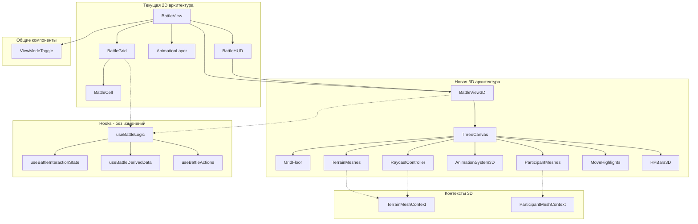

# План миграции на Three.js v3.0

## Обзор

Цель — добавить опциональную 3D-визуализацию боя через Three.js с сохранением существующей 2D функциональности. Пользователь сможет переключаться между режимами.

**Обновлено на основе второго ревью:** Исправлены логические ошибки, добавлены недостающие компоненты, согласован API, применен tree-shaking.

---

## Архитектура решения

### Диаграмма компонентов



### Принцип интеграции

**Ключевая идея**: 3D компоненты используют те же хуки и store, что и 2D. Меняется только рендеринг.

---

## Фазы реализации

### Фаза 1: Инфраструктура + Минимальный Terrain

#### Новые файлы

**`components/battle/three/ThreeCanvas.tsx`** (финальная версия)
```typescript
import { Canvas, useFrame } from '@react-three/fiber';
import { OrbitControls } from '@react-three/drei/core/OrbitControls';
import { PerspectiveCamera } from '@react-three/drei/core/PerspectiveCamera';
import { useRef, useCallback } from 'react';
import type { OrbitControls as OrbitControlsImpl } from 'three-stdlib';
import * as THREE from 'three';

interface ThreeCanvasProps {
  children: React.ReactNode;
  gridSize: { width: number; height: number };
}

// Константы камеры
const CAMERA_CONFIG = {
  minDistance: 5,
  maxDistance: 40,
  minPolarAngle: 0.3,
  maxPolarAngle: Math.PI / 2.2,
  initialHeight: 15,
  initialDistance: 15,
};

// Утилита clamp
const clamp = (value: number, min: number, max: number) =>
  Math.max(min, Math.min(max, value));

// Внутренний компонент для ограничения pan через useFrame
const CameraController: React.FC<{ panLimit: number }> = ({ panLimit }) => {
  const controlsRef = useRef<OrbitControlsImpl>(null);

  useFrame(() => {
    if (controlsRef.current) {
      const target = controlsRef.current.target;
      target.x = clamp(target.x, -panLimit, panLimit);
      target.z = clamp(target.z, -panLimit, panLimit);
    }
  });

  return (
    <OrbitControls
      ref={controlsRef}
      enablePan={true}
      enableZoom={true}
      enableRotate={true}
      enableDamping={true}
      dampingFactor={0.05}
      minDistance={CAMERA_CONFIG.minDistance}
      maxDistance={CAMERA_CONFIG.maxDistance}
      minPolarAngle={CAMERA_CONFIG.minPolarAngle}
      maxPolarAngle={CAMERA_CONFIG.maxPolarAngle}
      touches={{
        ONE: 1, // ROTATE
        TWO: 6  // DOLLY_PAN
      }}
    />
  );
};

export const ThreeCanvas: React.FC<ThreeCanvasProps> = ({ children, gridSize }) => {
  const panLimit = Math.max(gridSize.width, gridSize.height) / 2 + 2;

  // Обработка WebGL context loss
  const handleCreated = useCallback(({ gl }: { gl: THREE.WebGLRenderer }) => {
    gl.domElement.addEventListener('webglcontextlost', (e) => {
      e.preventDefault();
      console.error('WebGL context lost. Please refresh the page.');
      // TODO: показать UI уведомление пользователю
    });

    gl.domElement.addEventListener('webglcontextrestored', () => {
      console.log('WebGL context restored');
    });
  }, []);

  return (
    <Canvas
      shadows
      resize={{ scroll: false, debounce: { scroll: 50, resize: 0 } }}
      onCreated={handleCreated}
    >
      <PerspectiveCamera
        makeDefault
        position={[0, CAMERA_CONFIG.initialHeight, CAMERA_CONFIG.initialDistance]}
      />
      <CameraController panLimit={panLimit} />
      <ambientLight intensity={0.4} />
      <directionalLight position={[10, 20, 10]} intensity={0.8} castShadow />
      {children}
    </Canvas>
  );
};
```

**`components/battle/three/contexts/TerrainMeshContext.tsx`**
```typescript
import React, { createContext, useContext, useRef } from 'react';
import * as THREE from 'three';

interface TerrainMeshContextType {
  register: (id: string, mesh: THREE.Mesh) => void;
  unregister: (id: string) => void;
  getMeshes: () => THREE.Mesh[];
}

const TerrainMeshContext = createContext<TerrainMeshContextType | null>(null);

export const TerrainMeshProvider: React.FC<{ children: React.ReactNode }> = ({ children }) => {
  const meshesRef = useRef<Map<string, THREE.Mesh>>(new Map());

  const contextValue: TerrainMeshContextType = {
    register: (id: string, mesh: THREE.Mesh) => {
      meshesRef.current.set(id, mesh);
    },
    unregister: (id: string) => {
      meshesRef.current.delete(id);
    },
    getMeshes: () => Array.from(meshesRef.current.values()),
  };

  return (
    <TerrainMeshContext.Provider value={contextValue}>
      {children}
    </TerrainMeshContext.Provider>
  );
};

export const useTerrainMeshContext = () => {
  const context = useContext(TerrainMeshContext);
  if (!context) {
    throw new Error('useTerrainMeshContext must be used within TerrainMeshProvider');
  }
  return context;
};
```

**`components/battle/three/GridFloor.tsx`**
```typescript
import { useMemo } from 'react';
import * as THREE from 'three';
import { TILE_SIZE } from '@/constants/three';

interface GridFloorProps {
  gridSize: { width: number; height: number };
}

export const GridFloor: React.FC<GridFloorProps> = ({ gridSize }) => {
  // Создаём текстуру сетки программно
  const gridTexture = useMemo(() => {
    const size = 64;
    const canvas = document.createElement('canvas');
    canvas.width = size;
    canvas.height = size;
    const ctx = canvas.getContext('2d')!;

    // Фон
    ctx.fillStyle = '#1a1a2e';
    ctx.fillRect(0, 0, size, size);

    // Линии сетки
    ctx.strokeStyle = '#2a2a4e';
    ctx.lineWidth = 2;
    ctx.strokeRect(0, 0, size, size);

    const texture = new THREE.CanvasTexture(canvas);
    texture.wrapS = THREE.RepeatWrapping;
    texture.wrapT = THREE.RepeatWrapping;
    texture.repeat.set(gridSize.width, gridSize.height);

    return texture;
  }, [gridSize.width, gridSize.height]);

  return (
    <mesh
      rotation={[-Math.PI / 2, 0, 0]}
      position={[0, 0, 0]}
      receiveShadow
    >
      <planeGeometry args={[
        gridSize.width * TILE_SIZE,
        gridSize.height * TILE_SIZE
      ]} />
      <meshStandardMaterial map={gridTexture} />
    </mesh>
  );
};
```

**`components/battle/three/TerrainMesh.tsx`**
```typescript
import { useEffect, useRef } from 'react';
import * as THREE from 'three';
import { useTerrainMeshContext } from './contexts/TerrainMeshContext';
import { gridToWorld } from '@/services/three/coordinates';
import { WALL_HEIGHT, TILE_SIZE } from '@/constants/three';
import type { Terrain, GridSize } from '@/types/battle';

interface TerrainMeshProps {
  terrain: Terrain;
  gridSize: GridSize;
}

export const TerrainMesh: React.FC<TerrainMeshProps> = ({ terrain, gridSize }) => {
  const meshRef = useRef<THREE.Mesh>(null);
  const { register, unregister } = useTerrainMeshContext();

  // Регистрация для LoS raycasting
  useEffect(() => {
    if (meshRef.current) {
      register(terrain.id, meshRef.current);
      return () => unregister(terrain.id);
    }
  }, [terrain.id, register, unregister]);

  // Позиция в world space
  const position = gridToWorld(terrain.position, gridSize, WALL_HEIGHT / 2);

  // Базовая геометрия по типу (расширить для всех 28 типов)
  const geometry = getTerrainGeometry(terrain);
  const material = getTerrainMaterial(terrain);

  return (
    <mesh
      ref={meshRef}
      position={[position.x, position.y, position.z]}
      castShadow
      receiveShadow
      userData={{ terrainId: terrain.id, terrainType: terrain.type }}
    >
      {geometry}
      {material}
    </mesh>
  );
};

// Временные функции - вынести в отдельный файл
function getTerrainGeometry(terrain: Terrain) {
  switch (terrain.type) {
    case 'Wall':
      return <boxGeometry args={[TILE_SIZE, WALL_HEIGHT, TILE_SIZE * 0.2]} />;
    case 'Barrel':
      return <cylinderGeometry args={[0.3, 0.35, 0.8, 8]} />;
    case 'Container':
      return <boxGeometry args={[TILE_SIZE * 2, WALL_HEIGHT, TILE_SIZE]} />;
    default:
      return <boxGeometry args={[TILE_SIZE * 0.8, 0.5, TILE_SIZE * 0.8]} />;
  }
}

function getTerrainMaterial(terrain: Terrain) {
  const colors: Record<string, string> = {
    Wall: '#666666',
    Barrel: '#8B4513',
    Container: '#2E5090',
    default: '#888888',
  };

  return (
    <meshStandardMaterial
      color={colors[terrain.type] || colors.default}
    />
  );
}
```

**`components/battle/ViewModeToggle.tsx`**
```typescript
import { useBattleStore } from '@/stores';

interface ViewModeToggleProps {
  is3D: boolean;
  onToggle: (value: boolean) => void;
}

export const ViewModeToggle: React.FC<ViewModeToggleProps> = ({
  is3D,
  onToggle
}) => {
  // Блокировка во время анимации
  const isAnimating = useBattleStore(state => state.animation !== null);

  return (
    <button
      disabled={isAnimating}
      onClick={() => onToggle(!is3D)}
      className={`px-3 py-1 rounded transition-colors ${
        isAnimating ? 'opacity-50 cursor-not-allowed' : 'hover:bg-surface-hover'
      }`}
      title={isAnimating ? "Wait for animation to complete" : undefined}
    >
      {is3D ? '2D View' : '3D View'}
    </button>
  );
};
```

**`hooks/useLocalStorage.ts`**
```typescript
import { useState } from 'react';

export function useLocalStorage<T>(
  key: string,
  initialValue: T
): [T, (value: T) => void] {
  const [storedValue, setStoredValue] = useState<T>(() => {
    try {
      const item = window.localStorage.getItem(key);
      return item ? JSON.parse(item) : initialValue;
    } catch {
      return initialValue;
    }
  });

  const setValue = (value: T) => {
    setStoredValue(value);
    window.localStorage.setItem(key, JSON.stringify(value));
  };

  return [storedValue, setValue];
}
```

**`components/battle/BattleView3D.tsx`** (финальная версия)
```typescript
import { useMemo } from 'react';
import { ThreeCanvas } from './three/ThreeCanvas';
import { GridFloor } from './three/GridFloor';
import { TerrainMesh } from './three/TerrainMesh';
import { RaycastController } from './three/RaycastController';
import { TerrainMeshProvider } from './three/contexts/TerrainMeshContext';
import BattleHUD from './BattleHUD';
import type { BattleLogic } from '@/hooks/useBattleLogic';
import { useBattleStore } from '@/stores';

interface BattleView3DProps {
  battleLogic: BattleLogic;
}

export const BattleView3D: React.FC<BattleView3DProps> = ({ battleLogic }) => {
  const { handlers } = battleLogic;

  // Данные из store (battleLogic может содержать только derived данные)
  const battle = useBattleStore(state => state.battle);

  if (!battle) return null;

  const { participants, terrain, gridSize } = battle;

  return (
    <div className="relative w-full h-full">
      <TerrainMeshProvider>
        <ThreeCanvas gridSize={gridSize}>
          {/* Пол с сеткой */}
          <GridFloor gridSize={gridSize} />

          {/* Terrain объекты */}
          {terrain.map(t => (
            <TerrainMesh key={t.id} terrain={t} gridSize={gridSize} />
          ))}

          {/* Обработка кликов */}
          <RaycastController
            battleLogic={battleLogic}
            gridSize={gridSize}
          />
        </ThreeCanvas>
      </TerrainMeshProvider>

      {/* HUD рендерится поверх как обычный React */}
      <BattleHUD battleLogic={battleLogic} />
    </div>
  );
};

export default BattleView3D;
```

### Фаза 2: Интерактивность (Picking Plane)

**`components/battle/three/RaycastController.tsx`** (исправленная версия)
```typescript
import { useRef, useCallback, useMemo } from 'react';
import { useThree } from '@react-three/fiber';
import { Plane, Vector3 } from 'three';
import { useTerrainMeshContext } from './contexts/TerrainMeshContext';
import { worldToGrid, isValidGridPos } from '@/services/three/coordinates';
import type { BattleLogic } from '@/hooks/useBattleLogic';
import type { Position, GridSize } from '@/types/battle';

interface RaycastControllerProps {
  battleLogic: BattleLogic;
  gridSize: GridSize;
}

export const RaycastController: React.FC<RaycastControllerProps> = ({
  battleLogic,
  gridSize
}) => {
  const { camera, raycaster } = useThree();
  const { getMeshes } = useTerrainMeshContext();
  const { handlers } = battleLogic;

  // Throttled hover (50ms)
  const throttledHover = useMemo(
    () => throttle((pos: Position) => handlers.onCellHover?.(pos), 50),
    [handlers.onCellHover]
  );

  // Picking plane на уровне земли
  const pickingPlane = useMemo(() => new Plane(new Vector3(0, 1, 0), 0), []);

  const handlePointerMove = useCallback((event: any) => {
    // Raycast на picking plane
    raycaster.setFromCamera(event.pointer, camera);
    const intersection = new Vector3();
    raycaster.ray.intersectPlane(pickingPlane, intersection);

    if (intersection) {
      const gridPos = worldToGrid(intersection, gridSize);
      throttledHover(gridPos);
    }
  }, [camera, raycaster, pickingPlane, gridSize, throttledHover]);

  const handleClick = useCallback((event: any) => {
    // Raycast на picking plane для получения grid позиции
    raycaster.setFromCamera(event.pointer, camera);
    const intersection = new Vector3();
    raycaster.ray.intersectPlane(pickingPlane, intersection);

    if (intersection) {
      const gridPos = worldToGrid(intersection, gridSize);

      // Валидация позиции происходит в handlers.onCellClick
      // Там уже есть логика проверки walkability
      if (isValidGridPos(gridPos, gridSize)) {
        handlers.onCellClick?.(gridPos);
      }
    }
  }, [camera, raycaster, pickingPlane, gridSize, handlers.onCellClick]);

  return (
    <mesh
      position={[0, 0, 0]}
      rotation={[-Math.PI / 2, 0, 0]} // Плоскость XZ
      onPointerMove={handlePointerMove}
      onClick={handleClick}
      visible={false} // Невидимая picking plane
    >
      <planeGeometry args={[gridSize.width, gridSize.height]} />
      <meshBasicMaterial transparent opacity={0} />
    </mesh>
  );
};

// Utility function
function throttle<T extends (...args: any[]) => any>(
  func: T,
  delay: number
): T {
  let timeoutId: NodeJS.Timeout;
  let lastExecTime = 0;
  return ((...args: any[]) => {
    const currentTime = Date.now();
    if (currentTime - lastExecTime > delay) {
      func(...args);
      lastExecTime = currentTime;
    } else {
      clearTimeout(timeoutId);
      timeoutId = setTimeout(() => {
        func(...args);
        lastExecTime = Date.now();
      }, delay - (currentTime - lastExecTime));
    }
  }) as T;
}
```

### Фаза 3: Участники + Выделение

**`components/battle/three/ParticipantMesh.tsx`** (скелет)
```typescript
import { useRef } from 'react';
import * as THREE from 'three';
import { gridToWorld } from '@/services/three/coordinates';
import { CHARACTER_HEIGHT } from '@/constants/three';
import type { Participant, GridSize } from '@/types/battle';

interface ParticipantMeshProps {
  participant: Participant;
  gridSize: GridSize;
  isSelected: boolean;
  isActive: boolean;
  isAnimating: boolean;
}

export const ParticipantMesh: React.FC<ParticipantMeshProps> = ({
  participant,
  gridSize,
  isSelected,
  isActive,
  isAnimating
}) => {
  const meshRef = useRef<THREE.Mesh>(null);

  // Позиция в world space
  const position = gridToWorld(participant.position, gridSize, CHARACTER_HEIGHT / 2);

  // Цвет по состоянию
  const color = isSelected ? '#00ff00' : isActive ? '#ffff00' : '#ffffff';

  return (
    <mesh
      ref={meshRef}
      position={[position.x, position.y, position.z]}
      castShadow
    >
      <capsuleGeometry args={[0.3, 0.8, 4, 8]} />
      <meshStandardMaterial color={color} />
    </mesh>
  );
};
```

### Фаза 4: Оставшийся Terrain

**Задачи:**
- Расширить `getTerrainGeometry` и `getTerrainMaterial` для всех 28 типов
- Оптимизировать рендеринг с InstancedMesh для повторяющихся объектов

### Фаза 5: Анимации

**`components/battle/three/animations/MoveAnimation.tsx`** (скелет)
```typescript
import { useRef } from 'react';
import { useFrame } from '@react-three/fiber';
import * as THREE from 'three';
import { gridToWorld } from '@/services/three/coordinates';
import { MOVE_SPEED } from '@/constants/three';
import type { Position, GridSize } from '@/types/battle';

interface MoveAnimationProps {
  unitId: string;
  path: Position[];
  gridSize: GridSize;
  onComplete: () => void;
}

export const MoveAnimation: React.FC<MoveAnimationProps> = ({
  unitId,
  path,
  gridSize,
  onComplete
}) => {
  const progressRef = useRef(0);
  const pathIndex = useRef(0);

  // Получить mesh по unitId (нужен контекст или хук)
  // const meshRef = useParticipantMesh(unitId);

  useFrame((_, delta) => {
    // const mesh = meshRef.current;
    // if (!mesh) return;

    progressRef.current += delta * MOVE_SPEED;

    if (progressRef.current >= 1) {
      pathIndex.current++;
      progressRef.current = 0;

      if (pathIndex.current >= path.length - 1) {
        onComplete();
        return;
      }
    }

    // Интерполяция позиции
    // const from = gridToWorld(path[pathIndex.current], gridSize);
    // const to = gridToWorld(path[pathIndex.current + 1], gridSize);
    // mesh.position.lerpVectors(from, to, progressRef.current);
  });

  return null; // Анимация управляет существующим mesh
};
```

### Фаза 6: Оптимизация + Полировка

**`components/battle/three/MoveHighlights.tsx`** (скелет)
```typescript
import { useRef, useEffect } from 'react';
import * as THREE from 'three';
import { gridToWorld } from '@/services/three/coordinates';
import { TILE_SIZE } from '@/constants/three';
import type { Position, GridSize } from '@/types/battle';

interface MoveHighlightsProps {
  positions: Position[];
  gridSize: GridSize;
}

export const MoveHighlights: React.FC<MoveHighlightsProps> = ({
  positions,
  gridSize
}) => {
  const meshRef = useRef<THREE.InstancedMesh>(null);

  useEffect(() => {
    if (!meshRef.current) return;

    const dummy = new THREE.Object3D();
    positions.forEach((pos, i) => {
      const world = gridToWorld(pos, gridSize, 0.02);
      dummy.position.set(world.x, world.y, world.z);
      dummy.updateMatrix();
      meshRef.current!.setMatrixAt(i, dummy.matrix);
    });
    meshRef.current.instanceMatrix.needsUpdate = true;
  }, [positions, gridSize]);

  return (
    <instancedMesh ref={meshRef} args={[undefined, undefined, positions.length]}>
      <planeGeometry args={[TILE_SIZE * 0.9, TILE_SIZE * 0.9]} />
      <meshBasicMaterial color="#00ff00" transparent opacity={0.3} />
    </instancedMesh>
  );
};
```

**`components/battle/three/HPBars3D.tsx`** (скелет)
```typescript
import { Html } from '@react-three/drei/web/Html';
import { CHARACTER_HEIGHT } from '@/constants/three';
import type { Participant } from '@/types/battle';

interface HPBars3DProps {
  participants: Participant[];
}

export const HPBars3D: React.FC<HPBars3DProps> = ({ participants }) => {
  return (
    <>
      {participants.map(p => (
        <Html
          key={p.id}
          position={[p.position.x, CHARACTER_HEIGHT + 0.5, p.position.y]}
          center
          distanceFactor={10}
          occlude
        >
          <div className="bg-black/70 px-2 py-1 rounded text-xs whitespace-nowrap">
            <div className="w-16 h-1 bg-gray-700 rounded">
              <div
                className="h-full bg-green-500 rounded"
                style={{ width: `${(p.hp / p.maxHp) * 100}%` }}
              />
            </div>
          </div>
        </Html>
      ))}
    </>
  );
};
```

---

## Изменения в существующих файлах

**`package.json`**
```json
{
  "dependencies": {
    "three": "^0.170.0",
    "@react-three/fiber": "^8.17.0",
    "@react-three/drei": "^9.117.0"
  },
  "devDependencies": {
    "@types/three": "^0.170.0",
    "@react-three/test-renderer": "^8.17.0"
  }
}
```

**`BattleView.tsx`**
```typescript
import { Suspense, lazy } from 'react';
import { useLocalStorage } from '@/hooks/useLocalStorage';
import { ViewModeToggle } from './ViewModeToggle';
import { BattleLoadingScreen } from './BattleLoadingScreen';

// Lazy load 3D модуля для уменьшения initial bundle
const BattleView3D = lazy(() => import('./BattleView3D'));

const BattleView: React.FC = () => {
  const [is3D, setIs3D] = useLocalStorage('battleViewMode', false);
  const battleLogic = useBattleLogic();

  return (
    <div className="relative">
      <ViewModeToggle is3D={is3D} onToggle={setIs3D} />

      {is3D ? (
        <Suspense fallback={<BattleLoadingScreen />}>
          <BattleView3D battleLogic={battleLogic} />
        </Suspense>
      ) : (
        // текущий 2D рендеринг
      )}
    </div>
  );
};
```

---

## Оценка bundle size

**Реалистичные цифры с tree-shaking:**
| Компонент | Размер (gzip) |
|-----------|---------------|
| three | ~150KB |
| @react-three/fiber | ~50KB |
| @react-three/drei (tree-shaken) | ~60-80KB |
| **Итого базовый** | **~260-280KB** |

**С нашим кодом:**
- Terrain геометрии: +40KB
- Materials и текстуры: +25KB
- Анимации: +15KB
- **Итого: ~580-720KB**

---

## Стратегия тестирования

```typescript
// jest.setup.ts
import '@testing-library/jest-dom';

// Мок WebGL
class WebGLRenderingContext {}
global.WebGLRenderingContext = WebGLRenderingContext;

// Для react-three-fiber тестов
import { createRoot } from '@react-three/test-renderer';

describe('TerrainMesh', () => {
  it('renders correct geometry for Wall terrain', async () => {
    const terrain: Terrain = { type: 'Wall', position: { x: 0, y: 0 } };
    const renderer = await createRoot(<TerrainMesh terrain={terrain} gridSize={{width: 10, height: 10}} />);

    expect(renderer.scene.children[0].geometry.type).toBe('BoxGeometry');
  });
});
```

---

## Следующие шаги

1. **Сейчас:** Начать с Фазы 1 — инфраструктура
2. **Неделя 1:** Фаза 1 (Infrastructure + Minimal Terrain)
3. **Неделя 2:** Фаза 2 (Interactivity)
4. **Неделя 3:** Фазы 3-4 (Participants + Terrain)
5. **Неделя 4:** Фазы 5-6 (Animations + Polish)

**Критерии успеха:**
- 3D режим загружается без ошибок
- Кликабельная карта с точными координатами
- Bundle size < 750KB
- 60 FPS на средних устройствах