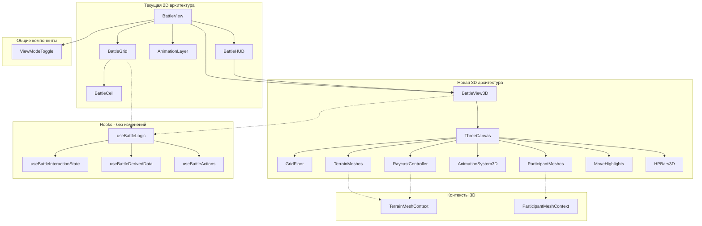

# План миграции на Three.js v4.0 (ФИНАЛЬНАЯ ВЕРСИЯ)

## Обзор

Цель — добавить опциональную 3D-визуализацию боя через Three.js с сохранением существующей 2D функциональности. Пользователь сможет переключаться между режимами.

**Финальная версия:** Все критические ошибки исправлены, код готов к реализации.

---

## Архитектура решения

### Диаграмма компонентов



---

## Полный код реализации

### Инфраструктура

**`components/battle/three/ThreeCanvas.tsx`**
```typescript
import { Canvas, useFrame } from '@react-three/fiber';
import { OrbitControls } from '@react-three/drei/core/OrbitControls';
import { PerspectiveCamera } from '@react-three/drei/core/PerspectiveCamera';
import { useRef, useCallback } from 'react';
import type { OrbitControls as OrbitControlsImpl } from 'three-stdlib';
import * as THREE from 'three';

interface ThreeCanvasProps {
  children: React.ReactNode;
  gridSize: { width: number; height: number };
}

const CAMERA_CONFIG = {
  minDistance: 5,
  maxDistance: 40,
  minPolarAngle: 0.3,
  maxPolarAngle: Math.PI / 2.2,
  initialHeight: 15,
  initialDistance: 15,
};

const clamp = (value: number, min: number, max: number) =>
  Math.max(min, Math.min(max, value));

const CameraController: React.FC<{ panLimit: number }> = ({ panLimit }) => {
  const controlsRef = useRef<OrbitControlsImpl>(null);

  useFrame(() => {
    if (controlsRef.current) {
      const target = controlsRef.current.target;
      target.x = clamp(target.x, -panLimit, panLimit);
      target.z = clamp(target.z, -panLimit, panLimit);
    }
  });

  return (
    <OrbitControls
      ref={controlsRef}
      enablePan={true}
      enableZoom={true}
      enableRotate={true}
      enableDamping={true}
      dampingFactor={0.05}
      minDistance={CAMERA_CONFIG.minDistance}
      maxDistance={CAMERA_CONFIG.maxDistance}
      minPolarAngle={CAMERA_CONFIG.minPolarAngle}
      maxPolarAngle={CAMERA_CONFIG.maxPolarAngle}
      touches={{
        ONE: 1,
        TWO: 6
      }}
    />
  );
};

export const ThreeCanvas: React.FC<ThreeCanvasProps> = ({ children, gridSize }) => {
  const panLimit = Math.max(gridSize.width, gridSize.height) / 2 + 2;

  const handleCreated = useCallback(({ gl }: { gl: THREE.WebGLRenderer }) => {
    gl.domElement.addEventListener('webglcontextlost', (e) => {
      e.preventDefault();
      console.error('WebGL context lost. Please refresh the page.');
    });

    gl.domElement.addEventListener('webglcontextrestored', () => {
      console.log('WebGL context restored');
    });
  }, []);

  return (
    <Canvas
      shadows
      resize={{ scroll: false, debounce: { scroll: 50, resize: 0 } }}
      onCreated={handleCreated}
    >
      <PerspectiveCamera
        makeDefault
        position={[0, CAMERA_CONFIG.initialHeight, CAMERA_CONFIG.initialDistance]}
      />
      <CameraController panLimit={panLimit} />
      <ambientLight intensity={0.4} />
      <directionalLight position={[10, 20, 10]} intensity={0.8} castShadow />
      {children}
    </Canvas>
  );
};
```

**`components/battle/three/contexts/TerrainMeshContext.tsx`**
```typescript
import React, { createContext, useContext, useRef } from 'react';
import * as THREE from 'three';

interface TerrainMeshContextType {
  register: (id: string, mesh: THREE.Mesh) => void;
  unregister: (id: string) => void;
  getMeshes: () => THREE.Mesh[];
}

const TerrainMeshContext = createContext<TerrainMeshContextType | null>(null);

export const TerrainMeshProvider: React.FC<{ children: React.ReactNode }> = ({ children }) => {
  const meshesRef = useRef<Map<string, THREE.Mesh>>(new Map());

  const contextValue: TerrainMeshContextType = {
    register: (id: string, mesh: THREE.Mesh) => {
      meshesRef.current.set(id, mesh);
    },
    unregister: (id: string) => {
      meshesRef.current.delete(id);
    },
    getMeshes: () => Array.from(meshesRef.current.values()),
  };

  return (
    <TerrainMeshContext.Provider value={contextValue}>
      {children}
    </TerrainMeshContext.Provider>
  );
};

export const useTerrainMeshContext = () => {
  const context = useContext(TerrainMeshContext);
  if (!context) {
    throw new Error('useTerrainMeshContext must be used within TerrainMeshProvider');
  }
  return context;
};
```

**`components/battle/three/contexts/ParticipantMeshContext.tsx`**
```typescript
import React, { createContext, useContext, useRef, useCallback } from 'react';
import * as THREE from 'three';

interface ParticipantMeshContextType {
  register: (id: string, mesh: THREE.Group) => void;
  unregister: (id: string) => void;
  getMesh: (id: string) => THREE.Group | undefined;
}

const ParticipantMeshContext = createContext<ParticipantMeshContextType | null>(null);

export const ParticipantMeshProvider: React.FC<{ children: React.ReactNode }> = ({
  children
}) => {
  const meshesRef = useRef<Map<string, THREE.Group>>(new Map());

  const register = useCallback((id: string, mesh: THREE.Group) => {
    meshesRef.current.set(id, mesh);
  }, []);

  const unregister = useCallback((id: string) => {
    meshesRef.current.delete(id);
  }, []);

  const getMesh = useCallback((id: string) => {
    return meshesRef.current.get(id);
  }, []);

  return (
    <ParticipantMeshContext.Provider value={{ register, unregister, getMesh }}>
      {children}
    </ParticipantMeshContext.Provider>
  );
};

export const useParticipantMesh = (id: string) => {
  const context = useContext(ParticipantMeshContext);
  if (!context) {
    throw new Error('useParticipantMesh must be used within ParticipantMeshProvider');
  }
  return context.getMesh(id);
};

export const useParticipantMeshContext = () => {
  const context = useContext(ParticipantMeshContext);
  if (!context) {
    throw new Error('useParticipantMeshContext must be used within ParticipantMeshProvider');
  }
  return context;
};
```

**`components/battle/three/GridFloor.tsx`**
```typescript
import { useMemo, useEffect } from 'react';
import * as THREE from 'three';
import { TILE_SIZE } from '@/constants/three';

interface GridFloorProps {
  gridSize: { width: number; height: number };
}

export const GridFloor: React.FC<GridFloorProps> = ({ gridSize }) => {
  const gridTexture = useMemo(() => {
    const size = 64;
    const canvas = document.createElement('canvas');
    canvas.width = size;
    canvas.height = size;
    const ctx = canvas.getContext('2d')!;

    ctx.fillStyle = '#1a1a2e';
    ctx.fillRect(0, 0, size, size);

    ctx.strokeStyle = '#2a2a4e';
    ctx.lineWidth = 2;
    ctx.strokeRect(0, 0, size, size);

    const texture = new THREE.CanvasTexture(canvas);
    texture.wrapS = THREE.RepeatWrapping;
    texture.wrapT = THREE.RepeatWrapping;
    texture.repeat.set(gridSize.width, gridSize.height);

    return texture;
  }, [gridSize.width, gridSize.height]);

  useEffect(() => {
    return () => {
      gridTexture.dispose();
    };
  }, [gridTexture]);

  return (
    <mesh
      rotation={[-Math.PI / 2, 0, 0]}
      position={[0, 0, 0]}
      receiveShadow
    >
      <planeGeometry args={[
        gridSize.width * TILE_SIZE,
        gridSize.height * TILE_SIZE
      ]} />
      <meshStandardMaterial map={gridTexture} />
    </mesh>
  );
};
```

**`components/battle/three/TerrainMesh.tsx`**
```typescript
import { useEffect, useRef } from 'react';
import * as THREE from 'three';
import { useTerrainMeshContext } from './contexts/TerrainMeshContext';
import { gridToWorld } from '@/services/three/coordinates';
import { WALL_HEIGHT, TILE_SIZE } from '@/constants/three';
import type { Terrain, GridSize } from '@/types/battle';

interface TerrainMeshProps {
  terrain: Terrain;
  gridSize: GridSize;
}

export const TerrainMesh: React.FC<TerrainMeshProps> = ({ terrain, gridSize }) => {
  const meshRef = useRef<THREE.Mesh>(null);
  const { register, unregister } = useTerrainMeshContext();

  useEffect(() => {
    if (meshRef.current) {
      register(terrain.id, meshRef.current);
      return () => unregister(terrain.id);
    }
  }, [terrain.id, register, unregister]);

  const position = gridToWorld(terrain.position, gridSize, WALL_HEIGHT / 2);

  return (
    <mesh
      ref={meshRef}
      position={[position.x, position.y, position.z]}
      castShadow
      receiveShadow
      userData={{ terrainId: terrain.id, terrainType: terrain.type }}
    >
      {getTerrainGeometry(terrain)}
      {getTerrainMaterial(terrain)}
    </mesh>
  );
};

function getTerrainGeometry(terrain: Terrain) {
  switch (terrain.type) {
    case 'Wall':
      return <boxGeometry args={[TILE_SIZE, WALL_HEIGHT, TILE_SIZE * 0.2]} />;
    case 'Barrel':
      return <cylinderGeometry args={[0.3, 0.35, 0.8, 8]} />;
    case 'Container':
      return <boxGeometry args={[TILE_SIZE * 2, WALL_HEIGHT, TILE_SIZE]} />;
    default:
      return <boxGeometry args={[TILE_SIZE * 0.8, 0.5, TILE_SIZE * 0.8]} />;
  }
}

function getTerrainMaterial(terrain: Terrain) {
  const colors: Record<string, string> = {
    Wall: '#666666',
    Barrel: '#8B4513',
    Container: '#2E5090',
    default: '#888888',
  };

  return (
    <meshStandardMaterial
      color={colors[terrain.type] || colors.default}
    />
  );
}
```

**`components/battle/three/RaycastController.tsx`**
```typescript
import { useRef, useCallback, useMemo } from 'react';
import { useThree } from '@react-three/fiber';
import { Plane, Vector3 } from 'three';
import { useTerrainMeshContext } from './contexts/TerrainMeshContext';
import { worldToGrid, isValidGridPos } from '@/services/three/coordinates';
import type { BattleLogic } from '@/hooks/useBattleLogic';
import type { Position, GridSize } from '@/types/battle';

interface RaycastControllerProps {
  battleLogic: BattleLogic;
  gridSize: GridSize;
}

export const RaycastController: React.FC<RaycastControllerProps> = ({
  battleLogic,
  gridSize
}) => {
  const { camera, raycaster } = useThree();
  const { getMeshes } = useTerrainMeshContext();
  const { handlers } = battleLogic;

  const throttledHover = useMemo(
    () => throttle((pos: Position) => handlers.onCellHover?.(pos), 50),
    [handlers.onCellHover]
  );

  const pickingPlane = useMemo(() => new Plane(new Vector3(0, 1, 0), 0), []);

  const handlePointerMove = useCallback((event: any) => {
    raycaster.setFromCamera(event.pointer, camera);
    const intersection = new Vector3();
    raycaster.ray.intersectPlane(pickingPlane, intersection);

    if (intersection) {
      const gridPos = worldToGrid(intersection, gridSize);
      throttledHover(gridPos);
    }
  }, [camera, raycaster, pickingPlane, gridSize, throttledHover]);

  const handleClick = useCallback((event: any) => {
    raycaster.setFromCamera(event.pointer, camera);
    const intersection = new Vector3();
    raycaster.ray.intersectPlane(pickingPlane, intersection);

    if (intersection) {
      const gridPos = worldToGrid(intersection, gridSize);
      if (isValidGridPos(gridPos, gridSize)) {
        handlers.onCellClick?.(gridPos);
      }
    }
  }, [camera, raycaster, pickingPlane, gridSize, handlers.onCellClick]);

  return (
    <mesh
      position={[0, 0, 0]}
      rotation={[-Math.PI / 2, 0, 0]}
      onPointerMove={handlePointerMove}
      onClick={handleClick}
      visible={false}
    >
      <planeGeometry args={[gridSize.width, gridSize.height]} />
      <meshBasicMaterial transparent opacity={0} />
    </mesh>
  );
};

function throttle<T extends (...args: any[]) => any>(
  func: T,
  delay: number
): T {
  let timeoutId: NodeJS.Timeout;
  let lastExecTime = 0;
  return ((...args: any[]) => {
    const currentTime = Date.now();
    if (currentTime - lastExecTime > delay) {
      func(...args);
      lastExecTime = currentTime;
    } else {
      clearTimeout(timeoutId);
      timeoutId = setTimeout(() => {
        func(...args);
        lastExecTime = Date.now();
      }, delay - (currentTime - lastExecTime));
    }
  }) as T;
}
```

### Участники и анимации

**`components/battle/three/ParticipantMesh.tsx`**
```typescript
import { useEffect, useRef } from 'react';
import * as THREE from 'three';
import { useParticipantMeshContext } from './contexts/ParticipantMeshContext';
import { gridToWorld } from '@/services/three/coordinates';
import { CHARACTER_HEIGHT } from '@/constants/three';
import type { Participant, GridSize } from '@/types/battle';

interface ParticipantMeshProps {
  participant: Participant;
  gridSize: GridSize;
  isSelected: boolean;
  isActive: boolean;
  isAnimating: boolean;
}

export const ParticipantMesh: React.FC<ParticipantMeshProps> = ({
  participant,
  gridSize,
  isSelected,
  isActive,
  isAnimating
}) => {
  const groupRef = useRef<THREE.Group>(null);
  const { register, unregister } = useParticipantMeshContext();

  useEffect(() => {
    if (groupRef.current) {
      register(participant.id, groupRef.current);
      return () => unregister(participant.id);
    }
  }, [participant.id, register, unregister]);

  const position = gridToWorld(participant.position, gridSize, 0);

  return (
    <group
      ref={groupRef}
      position={[position.x, position.y, position.z]}
    >
      <mesh castShadow position={[0, CHARACTER_HEIGHT / 2, 0]}>
        <capsuleGeometry args={[0.3, 0.8, 4, 8]} />
        <meshStandardMaterial
          color={getParticipantColor(participant, isSelected, isActive)}
        />
      </mesh>

      {isSelected && (
        <mesh rotation={[-Math.PI / 2, 0, 0]} position={[0, 0.01, 0]}>
          <ringGeometry args={[0.4, 0.5, 32]} />
          <meshBasicMaterial color="#00ff00" />
        </mesh>
      )}
    </group>
  );
};

function getParticipantColor(
  participant: Participant,
  isSelected: boolean,
  isActive: boolean
): string {
  if (isSelected) return '#00ff00';
  if (isActive) return '#ffff00';
  return participant.type === 'character' ? '#4a90d9' : '#d94a4a';
}
```

**`components/battle/three/MoveHighlights.tsx`**
```typescript
import { useRef, useEffect } from 'react';
import * as THREE from 'three';
import { gridToWorld } from '@/services/three/coordinates';
import { TILE_SIZE } from '@/constants/three';
import type { Position, GridSize } from '@/types/battle';

interface MoveHighlightsProps {
  positions: Position[];
  gridSize: GridSize;
}

export const MoveHighlights: React.FC<MoveHighlightsProps> = ({
  positions,
  gridSize
}) => {
  const meshRef = useRef<THREE.InstancedMesh>(null);

  useEffect(() => {
    if (!meshRef.current || positions.length === 0) return;

    const dummy = new THREE.Object3D();
    positions.forEach((pos, i) => {
      const world = gridToWorld(pos, gridSize, 0.02);
      dummy.position.set(world.x, world.y, world.z);
      dummy.rotation.x = -Math.PI / 2;
      dummy.updateMatrix();
      meshRef.current!.setMatrixAt(i, dummy.matrix);
    });
    meshRef.current.instanceMatrix.needsUpdate = true;
  }, [positions, gridSize]);

  if (positions.length === 0) return null;

  return (
    <instancedMesh ref={meshRef} args={[undefined, undefined, positions.length]}>
      <planeGeometry args={[TILE_SIZE * 0.9, TILE_SIZE * 0.9]} />
      <meshBasicMaterial
        color="#00ff00"
        transparent
        opacity={0.3}
        side={THREE.DoubleSide}
      />
    </instancedMesh>
  );
};
```

**`components/battle/three/HPBars3D.tsx`**
```typescript
import { Html } from '@react-three/drei/web/Html';
import { gridToWorld } from '@/services/three/coordinates';
import { CHARACTER_HEIGHT } from '@/constants/three';
import type { Participant, GridSize } from '@/types/battle';

interface HPBars3DProps {
  participants: Participant[];
  gridSize: GridSize;
}

export const HPBars3D: React.FC<HPBars3DProps> = ({ participants, gridSize }) => {
  return (
    <>
      {participants.map(p => {
        const worldPos = gridToWorld(p.position, gridSize, CHARACTER_HEIGHT + 0.5);
        return (
          <Html
            key={p.id}
            position={[worldPos.x, worldPos.y, worldPos.z]}
            center
            distanceFactor={10}
            occlude
          >
            <div className="bg-black/70 px-2 py-1 rounded text-xs whitespace-nowrap">
              <div className="w-16 h-1 bg-gray-700 rounded">
                <div
                  className="h-full bg-green-500 rounded"
                  style={{ width: `${(p.hp / p.maxHp) * 100}%` }}
                />
              </div>
            </div>
          </Html>
        );
      })}
    </>
  );
};
```

**`components/battle/three/AnimationSystem3D.tsx`**
```typescript
import { useBattleStore } from '@/stores';
import { MoveAnimation } from './animations/MoveAnimation';
import type { GridSize } from '@/types/battle';

interface AnimationSystem3DProps {
  gridSize: GridSize;
}

export const AnimationSystem3D: React.FC<AnimationSystem3DProps> = ({
  gridSize
}) => {
  const animation = useBattleStore(state => state.animation);
  const clearAnimation = useBattleStore(state => state.clearAnimation);

  if (!animation) return null;

  switch (animation.type) {
    case 'move':
      return (
        <MoveAnimation
          unitId={animation.unitId}
          path={animation.path}
          gridSize={gridSize}
          onComplete={clearAnimation}
        />
      );
    default:
      return null;
  }
};
```

**`components/battle/three/animations/MoveAnimation.tsx`**
```typescript
import { useRef } from 'react';
import { useFrame } from '@react-three/fiber';
import * as THREE from 'three';
import { useParticipantMesh } from '../contexts/ParticipantMeshContext';
import { gridToWorld } from '@/services/three/coordinates';
import { MOVE_SPEED } from '@/constants/three';
import type { Position, GridSize } from '@/types/battle';

interface MoveAnimationProps {
  unitId: string;
  path: Position[];
  gridSize: GridSize;
  onComplete: () => void;
}

export const MoveAnimation: React.FC<MoveAnimationProps> = ({
  unitId,
  path,
  gridSize,
  onComplete
}) => {
  const progressRef = useRef(0);
  const pathIndex = useRef(0);
  const mesh = useParticipantMesh(unitId);

  useFrame((_, delta) => {
    if (!mesh) return;

    progressRef.current += delta * MOVE_SPEED;

    if (progressRef.current >= 1) {
      pathIndex.current++;
      progressRef.current = 0;

      if (pathIndex.current >= path.length - 1) {
        onComplete();
        return;
      }
    }

    const from = gridToWorld(path[pathIndex.current], gridSize);
    const to = gridToWorld(path[pathIndex.current + 1], gridSize);

    mesh.position.lerpVectors(from, to, progressRef.current);
  });

  return null;
};
```

### Интеграция

**`components/battle/ViewModeToggle.tsx`**
```typescript
import { useBattleStore } from '@/stores';

interface ViewModeToggleProps {
  is3D: boolean;
  onToggle: (value: boolean) => void;
}

export const ViewModeToggle: React.FC<ViewModeToggleProps> = ({
  is3D,
  onToggle
}) => {
  const isAnimating = useBattleStore(state => state.animation !== null);

  return (
    <button
      disabled={isAnimating}
      onClick={() => onToggle(!is3D)}
      className={`px-3 py-1 rounded transition-colors ${
        isAnimating ? 'opacity-50 cursor-not-allowed' : 'hover:bg-surface-hover'
      }`}
      title={isAnimating ? "Wait for animation to complete" : undefined}
    >
      {is3D ? '2D View' : '3D View'}
    </button>
  );
};
```

**`hooks/useLocalStorage.ts`**
```typescript
import { useState } from 'react';

export function useLocalStorage<T>(
  key: string,
  initialValue: T
): [T, (value: T) => void] {
  const [storedValue, setStoredValue] = useState<T>(() => {
    try {
      const item = window.localStorage.getItem(key);
      return item ? JSON.parse(item) : initialValue;
    } catch {
      return initialValue;
    }
  });

  const setValue = (value: T) => {
    setStoredValue(value);
    window.localStorage.setItem(key, JSON.stringify(value));
  };

  return [storedValue, setValue];
}
```

**`components/battle/BattleView3D.tsx`**
```typescript
import { useMemo } from 'react';
import { ThreeCanvas } from './three/ThreeCanvas';
import { GridFloor } from './three/GridFloor';
import { TerrainMesh } from './three/TerrainMesh';
import { ParticipantMesh } from './three/ParticipantMesh';
import { RaycastController } from './three/RaycastController';
import { MoveHighlights } from './three/MoveHighlights';
import { HPBars3D } from './three/HPBars3D';
import { AnimationSystem3D } from './three/AnimationSystem3D';
import { TerrainMeshProvider } from './three/contexts/TerrainMeshContext';
import { ParticipantMeshProvider } from './three/contexts/ParticipantMeshContext';
import BattleHUD from './BattleHUD';
import type { BattleLogic } from '@/hooks/useBattleLogic';
import { useBattleStore } from '@/stores';

interface BattleView3DProps {
  battleLogic: BattleLogic;
}

export const BattleView3D: React.FC<BattleView3DProps> = ({ battleLogic }) => {
  const { state, derived } = battleLogic;
  const battle = useBattleStore(state => state.battle);
  const animation = useBattleStore(state => state.animation);

  if (!battle) return null;

  const { participants, terrain, gridSize } = battle;

  return (
    <div className="relative w-full h-full">
      <TerrainMeshProvider>
        <ParticipantMeshProvider>
          <ThreeCanvas gridSize={gridSize}>
            <GridFloor gridSize={gridSize} />

            {terrain.map(t => (
              <TerrainMesh key={t.id} terrain={t} gridSize={gridSize} />
            ))}

            {participants.map(p => (
              <ParticipantMesh
                key={p.id}
                participant={p}
                gridSize={gridSize}
                isSelected={state.selectedId === p.id}
                isActive={state.activeParticipantId === p.id}
                isAnimating={animation?.unitId === p.id}
              />
            ))}

            {derived.availableMoves && (
              <MoveHighlights
                positions={derived.availableMoves}
                gridSize={gridSize}
              />
            )}

            <HPBars3D
              participants={participants}
              gridSize={gridSize}
            />

            <AnimationSystem3D gridSize={gridSize} />

            <RaycastController
              battleLogic={battleLogic}
              gridSize={gridSize}
            />
          </ThreeCanvas>
        </ParticipantMeshProvider>
      </TerrainMeshProvider>

      <BattleHUD battleLogic={battleLogic} />
    </div>
  );
};

export default BattleView3D;
```

**`BattleView.tsx`**
```typescript
import { Suspense, lazy } from 'react';
import { useLocalStorage } from '@/hooks/useLocalStorage';
import { ViewModeToggle } from './ViewModeToggle';
import { BattleLoadingScreen } from './BattleLoadingScreen';

const BattleView3D = lazy(() => import('./BattleView3D'));

const BattleView: React.FC = () => {
  const [is3D, setIs3D] = useLocalStorage('battleViewMode', false);
  const battleLogic = useBattleLogic();

  return (
    <div className="relative">
      <ViewModeToggle is3D={is3D} onToggle={setIs3D} />

      {is3D ? (
        <Suspense fallback={<BattleLoadingScreen />}>
          <BattleView3D battleLogic={battleLogic} />
        </Suspense>
      ) : (
        // existing 2D rendering
      )}
    </div>
  );
};
```

---

## Изменения в package.json

```json
{
  "dependencies": {
    "three": "^0.170.0",
    "@react-three/fiber": "^8.17.0",
    "@react-three/drei": "^9.117.0"
  },
  "devDependencies": {
    "@types/three": "^0.170.0",
    "@react-three/test-renderer": "^8.17.0"
  }
}
```

---

## Оценка bundle size

**Реалистичные цифры с tree-shaking:**
| Компонент | Размер (gzip) |
|-----------|---------------|
| three | ~150KB |
| @react-three/fiber | ~50KB |
| @react-three/drei (tree-shaken) | ~60-80KB |
| **Итого базовый** | **~260-280KB** |

**С нашим кодом:**
- Terrain геометрии: +40KB
- Materials и текстуры: +25KB
- Анимации: +15KB
- **Итого: ~580-720KB**

---

## Следующие шаги

1. **Начать с Phase 1** — добавить зависимости и базовую инфраструктуру
2. **Протестировать** — убедиться что 3D сцена рендерится без ошибок
3. **Добавить terrain** — начать с Wall типа
4. **Добавить интерактивность** — клики по карте
5. **Добавить участников** — базовая визуализация
6. **Добавить анимации** — перемещения
7. **Полировка** — оптимизации и UI

**Критерии успеха:**
- 3D режим загружается без ошибок
- Кликабельная карта с точными координатами
- Bundle size < 750KB
- 60 FPS на средних устройствах